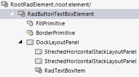
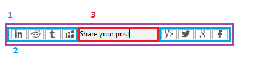

# Structure

This article describes the inner structure and organization of the elements which build the **RadButtonTextBox** control. 

**RadButtonTextBox** is a derivative of [RadTextBox]() and it internally uses     
        
>caption Figure 1: RadButtonTextBox's elements hierarchy

 

>caption Figure 2: RadButtonTextBox's structure

1. **RadButtonTextBoxElement** - represents the main element.
2. **StrechedHorizontalStackLayoutPanel** - hosts the left/right button elements.
3. **RadTextBoxItem** - handles the user's keyboard input. 
 

# See Also

* [RadControlSpy]()
            
