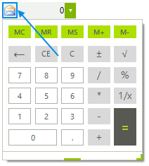
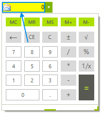
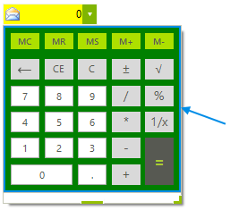
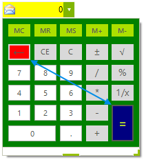

# Customization
 
This topic will demonstrate how to access different element in the control in order to change their appearance.
      
## Memory Element Visual Customization

{{source=..\SamplesCS\Editors\RadCalculatorDropDownCustomization.cs region=ChangeTheImageOfMemoryElement}} 
{{source=..\SamplesVB\Editors\RadCalculatorDropDownCustomization.vb region=ChangeTheImageOfMemoryElement}} 

````C#
this.radCalculatorDropDown1.CalculatorElement.MemoryElement.Image = Resources.email;

````
````VB.NET
Me.RadCalculatorDropDown1.CalculatorElement.MemoryElement.Image = My.Resources.email

````

{{endregion}} 

>caption Figure 1: RadCalculatorMemoryElement Customization


## Text Box Visual Customization 

{{source=..\SamplesCS\Editors\RadCalculatorDropDownCustomization.cs region=ChangeTheBackColorOfTheTextBox}} 
{{source=..\SamplesVB\Editors\RadCalculatorDropDownCustomization.vb region=ChangeTheBackColorOfTheTextBox}} 

````C#
this.radCalculatorDropDown1.CalculatorElement.FillPrimitive.BackColor = Color.Yellow;
this.radCalculatorDropDown1.CalculatorElement.EditorContentElement.Fill.BackColor = Color.Yellow;

````
````VB.NET
Me.RadCalculatorDropDown1.CalculatorElement.FillPrimitive.BackColor = Color.Yellow
Me.RadCalculatorDropDown1.CalculatorElement.EditorContentElement.Fill.BackColor = Color.Yellow

````

{{endregion}} 

>caption Figure 2: Text Box Customization


## Calculator Visual Customization 

{{source=..\SamplesCS\Editors\RadCalculatorDropDownCustomization.cs region=ChangeTheBackColorOfTheCalculator}} 
{{source=..\SamplesVB\Editors\RadCalculatorDropDownCustomization.vb region=ChangeTheBackColorOfTheCalculator}} 

````C#
this.radCalculatorDropDown1.CalculatorElement.CalculatorContentElement.BackColor = Color.Green;

````
````VB.NET
Me.RadCalculatorDropDown1.CalculatorElement.CalculatorContentElement.BackColor = Color.Green

````

{{endregion}} 

>caption Figure 3: Calculator Customization


## Buttons Visual Customization 

{{source=..\SamplesCS\Editors\RadCalculatorDropDownCustomization.cs region=ChangeTheBackColorOfButtons}} 
{{source=..\SamplesVB\Editors\RadCalculatorDropDownCustomization.vb region=ChangeTheBackColorOfButtons}} 

````C#
this.radCalculatorDropDown1.CalculatorElement.CalculatorContentElement.ButtonEquals.GradientStyle = Telerik.WinControls.GradientStyles.Solid;
this.radCalculatorDropDown1.CalculatorElement.CalculatorContentElement.ButtonEquals.BackColor = Color.Navy;
this.radCalculatorDropDown1.CalculatorElement.CalculatorContentElement.ButtonDelete.GradientStyle = Telerik.WinControls.GradientStyles.Solid;
this.radCalculatorDropDown1.CalculatorElement.CalculatorContentElement.ButtonDelete.BackColor = Color.Red;

````
````VB.NET
Me.RadCalculatorDropDown1.CalculatorElement.CalculatorContentElement.ButtonEquals.GradientStyle = Telerik.WinControls.GradientStyles.Solid
Me.RadCalculatorDropDown1.CalculatorElement.CalculatorContentElement.ButtonEquals.BackColor = Color.Navy
Me.RadCalculatorDropDown1.CalculatorElement.CalculatorContentElement.ButtonDelete.GradientStyle = Telerik.WinControls.GradientStyles.Solid
Me.RadCalculatorDropDown1.CalculatorElement.CalculatorContentElement.ButtonDelete.BackColor = Color.Red

````

{{endregion}} 

>caption Figure 4: Button Elements Customization


## See Also

* [Design Time]()
* [Getting Started]()
