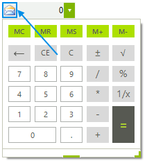
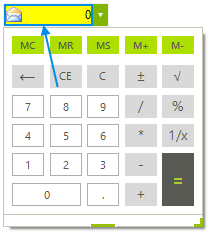
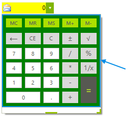
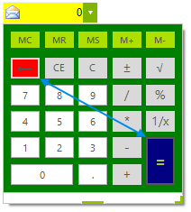

# Customization
 
This topic will demonstrate how to access different element in the control in order to change their appearance.
      
## Memory Element Visual Customization

<snippet id='editors-radcalculatordropdowncustomization-changetheimageofmemoryelement-cs' />
<snippet id='editors-radcalculatordropdowncustomization-changetheimageofmemoryelement-vb' />

>caption Figure 1: RadCalculatorMemoryElement Customization

## Text Box Visual Customization 

<snippet id='editors-radcalculatordropdowncustomization-changethebackcolorofthetextbox-cs' />
<snippet id='editors-radcalculatordropdowncustomization-changethebackcolorofthetextbox-vb' />

>caption Figure 2: Text Box Customization

## Calculator Visual Customization 

<snippet id='editors-radcalculatordropdowncustomization-changethebackcolorofthecalculator-cs' />
<snippet id='editors-radcalculatordropdowncustomization-changethebackcolorofthecalculator-vb' />

>caption Figure 3: Calculator Customization

## Buttons Visual Customization 

<snippet id='editors-radcalculatordropdowncustomization-changethebackcolorofbuttons-cs' />
<snippet id='editors-radcalculatordropdowncustomization-changethebackcolorofbuttons-vb' />

>caption Figure 4: Button Elements Customization

## See Also

* [Design Time]()
* [Getting Started]()
