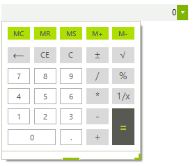
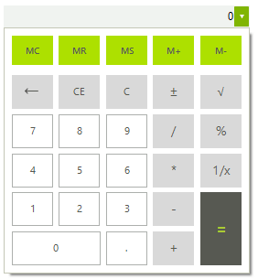

# Getting Started

The following example demonstrates how to set up __RadCalculatorDropDown__ with a minmum popup width and height.

>caption Figure 1: Before


1\. Drag a __RadCalculatorDropDown__ on a form.

2\. In the constructor of your form add the following code: 

{{source=..\SamplesCS\Editors\RadCalculatorDropDownGettingStarted.cs region=MinWidth}} 
{{source=..\SamplesVB\Editors\RadCalculatorDropDownGettingStarted.vb region=MinWidth}} 

````C#
int desiredWidth = this.radCalculatorDropDown1.Width;
this.radCalculatorDropDown1.CalculatorElement.MinPopupWidth = desiredWidth;
this.radCalculatorDropDown1.CalculatorElement.MinPopupHeight = desiredWidth;

````
````VB.NET
Dim desiredWidth As Integer = Me.RadCalculatorDropDown1.Width
Me.RadCalculatorDropDown1.CalculatorElement.MinPopupWidth = desiredWidth
Me.RadCalculatorDropDown1.CalculatorElement.MinPopupHeight = desiredWidth

````

{{endregion}} 

3\. Press __F5__ to run the application. Click the arrow button to open the drop-down. Notice its size equaling that of the editor.

>caption Figure 2: After


## See Also

* [Structure]()
* [Smart Tag]()
