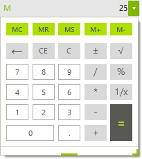

# CalculatorDropDown

__RadCalculatorDropDown__ has a simple easy-to-use interface enabling the end user to perform all basic calculations such as addition, subtraction, multiplication, division as well as some more complicated ones – reciprocal, square root, negate.

The operations can be executed either by clicking the calculator buttons, or by using your keyboard. You can also use the numeric keypad to type numbers and operators by pressing Num Lock. Furthermore, all the Memory and Clear features are exposed as well.





>caption Figure 1: RadCalculatorDropDown

__RadCalculatorDropDown__ key features list:

* Basic calculations: Addition, subtraction, multiplication, division.            

* Additional calculations: Negate, square root, reciprocal.

* Keyboard support.

* Memory functionality.

* Clear entry, clear all, delete functionality.

* Customized functions.

## See Also

* [Structure]()
* [Getting Started]()
* [Smart Tag]()
            
