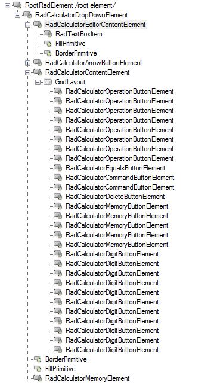
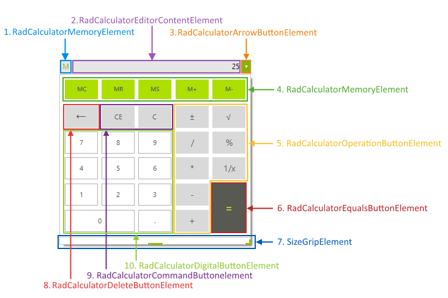

# Structure

This article describes the inner structure and organization of the elements which build the __RadCalculatorDropDown__ control.

__RadCalculatorDropDown__ consists of two parts - editable part which is the actual editor and a popup hosting the calculator.

>caption Figure 1: RadCalculatorDropDown`s Element Hierarchy

>caption Figure 2: RadCalculatorDropDown Structure

## Editable Area

The editable area consists of three elements:

* __Editable Area__: Contains the editor repsponsible for handling user input.

  * __RadCalculatorMemoryElement__: This element gets visible when the memory functions of the calculator are used.

  * __RadCalculatorEditorContentElement__: This is the editable area of the control.         
  
  * __RadCalculatorArrowButtonElement__: This the arrow button which opens the popup of the control.

## Drop-down Part

The popup part consists of six elements:

* __Drop-Down__: Handles the arithmetic operations.

  * __RadCalculatorMemoryButtonElement__: This is the type of the buttons for memory operations
           
  * __RadCalculatorOperationButtonElement__: This type is used by the buttons resposinble for different calculation operations (subscription, addition, etc).
  
  * __RadCalculatorEqualsButtonElement__: This class is used by the equals button.
  
  * __RadCalculatorCommandButtonElement__: This class is used by the command buttons (CE, C).      
  
  * __RadCalculatorDeleteButtonElement__: This type is used by the delete button.        
  
  * __RadCalculatorDigitButtonElement__: This type is used by the digit buttons.
            
## See Also

* [Design Time]()
* [Getting Started]()