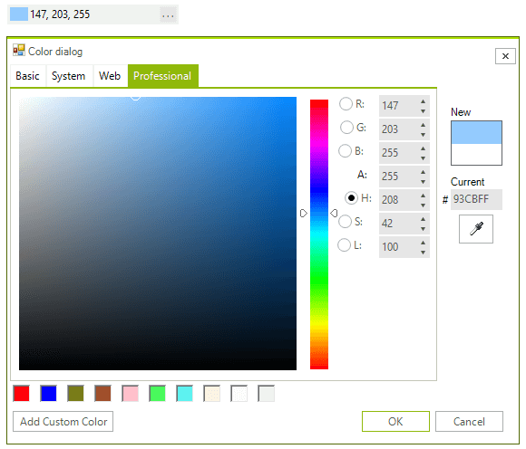

# ColorBox

The main purpose of the control is to allow the user to select a color from a [color dialog]() with preset colors or to type the color directly into the text field. The control then displays the color name if it is a named color or the RGB values of the selected color. A small rectangle filled with the selected color is displayed as well. The __RadColorBox__ supports input in the following formats:

* RGB – (203, 252, 12)
* Name – Red
* Hex - #CBFC0C





>caption Figure 1: RadColorBox

# See Also

* [Design Time]()
* [Getting Started]()
* [Structure]()
* [Properties and Events]()