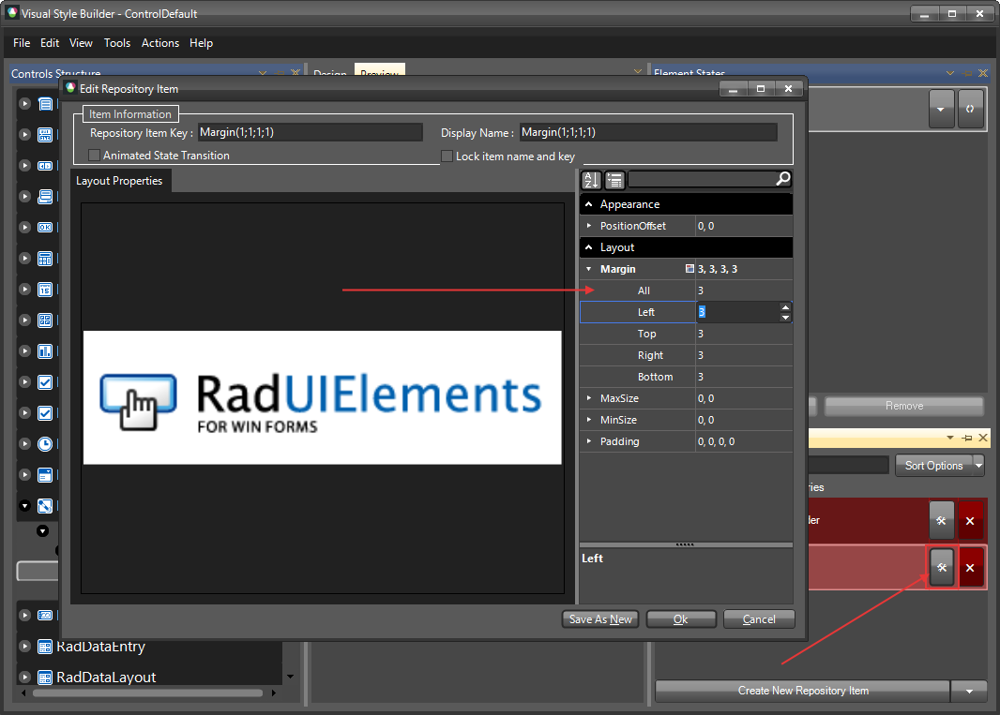
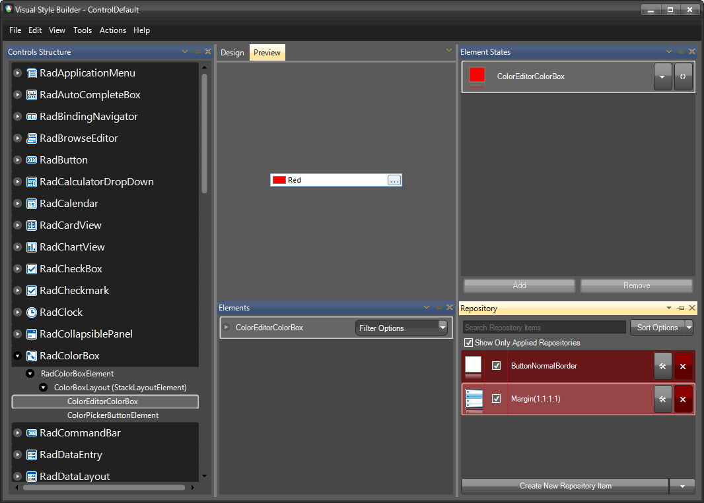

# Themes

This help article will demonstrate a step by step tutorial how to customize the `ControlDefault` theme for __RadColorBox__

1. Open [Visual Style Builder] ()
2. Export the built-in themes in a specific folder by selecting `File` >> `Export Built-in Themes`.
3. Load a desired theme from the just exported files by selecting `File` >> `Open Package`.
4. Expand __RadColorBox__ and select the `ColorEditorColorBox`. 
    

5. Open the `Edit Repository Item` dialog and change the `Margin`:
   

6. The Margin is now changed, the result is that the color box is smaller:
   

>note The following article shows how you can use the new theme: [Using Custom Themes]().

# See Also

* [Customizing Appearance]()
