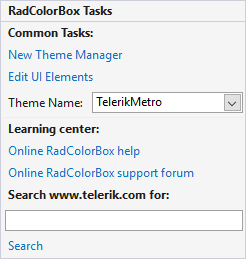

# Smart Tag

The __Smart Tag__ of __RadColorBox__ lets you quickly access common tasks involved with and customizing the layout or setting the theme.

>caption Figure 1: The Smart Tag of RadColorBox

 

* __Common Tasks__
    - __New Theme Manager:__ Adds a new __RadThemeManager__ component to the form.
    - __Edit UI elements:__ Opens a dialog that displays the __Element Hierarchy Editor.__ This editor lets you browse all the elements in the control.
    - __Theme Name:__ Select a theme name from the drop down list of themes available for that control. Selecting a theme allows you to change all aspects of the controls visual style at one time.
* __Learning Center:__ Navigate to the Telerik help, code library projects or support forum.
* __Search:__ Search the Telerik site for a given string.

# See Also

* [Add Themes]()
* [Getting Started]()
* [Structure]()
* [Properties and Events]()
