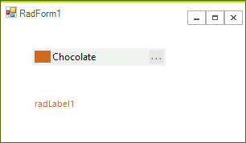

# Getting Started

The following example demonstrates how to change the __ForeColor__  of __RadLabel__ by using the __RadColorBox__.
		
>caption Figure 1: Synchronize Color.


 
1\. Drag __RadLabel__ and __RadColorBox__ to a form.

2\. Select the __RadColorBox__, click the __Events tab__ of the __Property Window__, locate the __ValueChanged__ event and double-click it to create an event handler. Replace the event handler with the following code. 

{{source=..\SamplesCS\Editors\ColorBox1.cs region=colorBoxValueChanged}} 
{{source=..\SamplesVB\Editors\ColorBox1.vb region=colorBoxValueChanged}} 

````C#
private void radColorBox1_ValueChanged(object sender, EventArgs e)
{
    this.radLabel1.ForeColor = this.radColorBox1.Value;
}

````
````VB.NET
Private Sub RadColorBox1_ValueChanged(sender As Object, e As EventArgs)
    Me.RadLabel1.ForeColor = Me.RadColorBox1.Value
End Sub

````

{{endregion}} 
 
3\. Press __F5__ to run the application. Press the color dialog button and select a color. The color is then applied as __ForeColor__ of the __RadLabel__.

# See Also

* [Design Time]()
* [Structure]()
* [Properties and Events]()