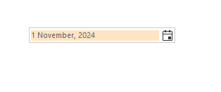

# Customizing Appearance

Each of the elements inside the __RadDateOnlyPicker__ control can be futher customized. In the following code snippet we will demonstrate how you can change the back color of the control programmatically.

````C#
this.radDateOnlyPicker1.DateOnlyPickerElement.TextBoxElement.BackColor = Color.Bisque;

````
````VB.NET
Me.RadDateOnlyPicker1.DateOnlyPickerElement.TextBoxElement.BackColor = Color.Bisque

````



## See Also

* [Customize Calendar]()
* [Themes]()
