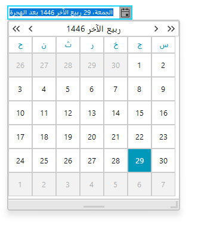

# CultureInfo and RegionInfo Basics
 
__RadDateOnlyPicker__ provides full support for the __System.Globalization Namespace__. This namespace consists of classes (__CompareInfo__, __CultureInfo__, __RegionInfo__, etc.) which contain culture-related information, such as the language, country/region, calendars in use, format patterns for dates, currency, and numbers, and the sort order for strings. They are useful classes for writing internationalized applications.

Two of the most important classes in this namespace are: __CultureInfo__ and __RegionInfo__. 

## CultureInfo

Represents information about a specific culture including the names of the culture, the writing system, and the calendar used, as well as access to culture-specific objects that provide information for common operations, such as formatting dates and sorting strings.

The culture names follow the RFC 1766 standard in the format "<languagecode2>-<country/regioncode2>", where <languagecode2> is a lowercase two-letter code derived from ISO 639-1 and <country/regioncode2> is an uppercase two-letter code derived from ISO 3166. For example, U.S. English is "en-US".

The complete list of the predefined __CultureInfo__ names and identifiers can be found in __CultureInfo__ class and  the classes in the __System.Globalization__ namespace.

The table below is a sample list of the names and identifiers found in the CultureInfo class.

| Culture Name | Culture Identifier | Language-Country/Region |
| ------- | ------- | ------- |
|bg-BG|0x0402|Bulgarian - Bulgaria|
|en-GB|0x0809|English - United Kingdom|
|fr-FR|0x040C|French - France|
|es-ES|0x0C0A|Spanish - Spain|
|ar-SA|0x0401|Arabic - Saudi Arabia|
|fa-IR|0x0429|Farsi - Iran|
|ps-AF|0x0463|Pashto - Afghanistan|
|ar-SA|0x0401|Arabic - Saudi Arabia|

>caption Figure: 1 Setting Arabic Culture



{{source=..\SamplesCS\Editors\DateOnlyPicker.cs region=SetPashtoCulture}} 
{{source=..\SamplesVB\Editors\DateOnlyPicker.vb region=SetPashtoCulture}} 

````C#
this.radDateOnlyPicker1.Culture = new System.Globalization.CultureInfo("ps-AF");

````
````VB.NET
Me.RadDateOnlyPicker1.Culture = New System.Globalization.CultureInfo("ps-AF")

````

{{endregion}}

## RegionInfo

The __RegionInfo__ class contains information about the country/region.  In contrast to __CultureInfo__, __RegionInfo__ does not represent preferences of the user and does not depend on the user's language or culture. The __RegionInfo__ name is one of the two-letter codes defined in ISO 3166 for country/region. Case is not significant; however, the __Name__, the __TwoLetterISORegionName__, and the __ThreeLetterISORegionName__ properties return the appropriate code in uppercase.

# See Also

* [Internationalization]()
* [Date Formats]()
