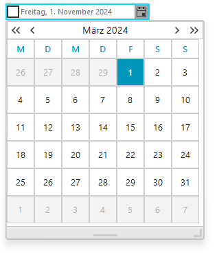
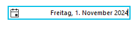

# Internationalization

RadCalendar provides built in internationalization support to build world-ready applications including: 

\* The __Culture__ property can be set using the drop down list in the Properties Window or set in code. The screenshot below shows the __Culture__ property set to "German(Germany)". 

{{source=..\SamplesCS\Editors\DateOnlyPicker.cs region=culture}} 
{{source=..\SamplesVB\Editors\DateOnlyPicker.vb region=culture}} 

````C#
this.radDateOnlyPicker1.Culture = new System.Globalization.CultureInfo("de-DE");

````
````VB.NET
Me.RadDateOnlyPicker1.Culture = New System.Globalization.CultureInfo("de-DE")

````

{{endregion}} 

>caption Figure 1: The culture is changed to German.



\* Right-to-Left support:          
            

* Right-to-Left = No (default value) 

{{source=..\SamplesCS\Editors\DateOnlyPicker.cs region=rightNo}} 
{{source=..\SamplesVB\Editors\DateOnlyPicker.vb region=rightNo}} 

````C#
this.radDateOnlyPicker1.RightToLeft = RightToLeft.No;

````
````VB.NET
Me.RadDateOnlyPicker1.RightToLeft = RightToLeft.No

````

{{endregion}} 

>caption Figure 2: The right to left support is turned off.


\*  Right-to-Left = Yes 

{{source=..\SamplesCS\Editors\DateOnlyPicker.cs region=rightYes}} 
{{source=..\SamplesVB\Editors\DateOnlyPicker.vb region=rightYes}} 

````C#
this.radDateTimePicker1.RightToLeft = RightToLeft.Yes;

````
````VB.NET
Me.RadDateTimePicker1.RightToLeft = RightToLeft.Yes

````

{{endregion}} 

>caption Figure 3: The right to left support is turned on.



\* [Date Format Pattern](): The __Format__ property has valid values of __Short__, __Long__, and __Custom__. The __Custom__enables the __CustomFormat__ property.  

> The __Time__ option of the __DateTimePickerFormat__ enumeration is not applicable for the RadDateOnlyPicker control. The __Time__ option will be ignored when set to the RadDateOnlyPicker control Format property. 

{{source=..\SamplesCS\Editors\DateOnlyPicker.cs region=customFormat}} 
{{source=..\SamplesVB\Editors\DateOnlyPicker.vb region=customFormat}} 

````C#
this.radDateTimePicker1.Format = DateTimePickerFormat.Custom;
this.radDateTimePicker1.CustomFormat = "MMM - dd - yyyy";

````
````VB.NET
Me.RadDateTimePicker1.Format = DateTimePickerFormat.Custom
Me.RadDateTimePicker1.CustomFormat = "MMM - dd - yyyy"

````

{{endregion}} 

>caption Figure 4: Using Custom Format


## See Also

* [CultureInfo and RegionInfo Basics]()
* [Date Formats]()
