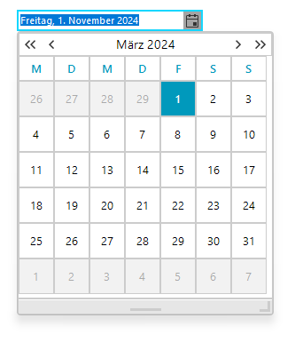
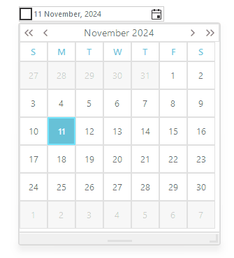

# Navigation Modes
 
The embedded __RadCalendar__ has `HeaderNavigationMode` property, which determines what will be the behavior of control when the end-users clicks on the header of __RadCalendar__. In this article we will demonstrate how to change the default navigation mode.

|HeaderNavigationMode|Design|
|----|----|
|Zoom||
|Popup||

#### Setting the value of RadDateOnlyPicker 

{{source=..\SamplesCS\Editors\DateOnlyPicker.cs region=HeaderNavigationMode}} 
{{source=..\SamplesVB\Editors\DateOnlyPicker.vb region=HeaderNavigationMode}} 

````C#
this.radDateOnlyPicker1.DateOnlyPickerElement.Calendar.HeaderNavigationMode = HeaderNavigationMode.Zoom;

````
````VB.NET
Me.RadDateOnlyPicker1.DateOnlyPickerElement.Calendar.HeaderNavigationMode = HeaderNavigationMode.Zoom

````

{{endregion}} 



## See Also

* [Design Time]()
* [MaskDateOnlyProvider]()
* [Properties]()
* [Structure]()
