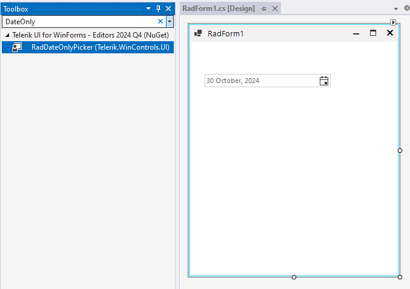
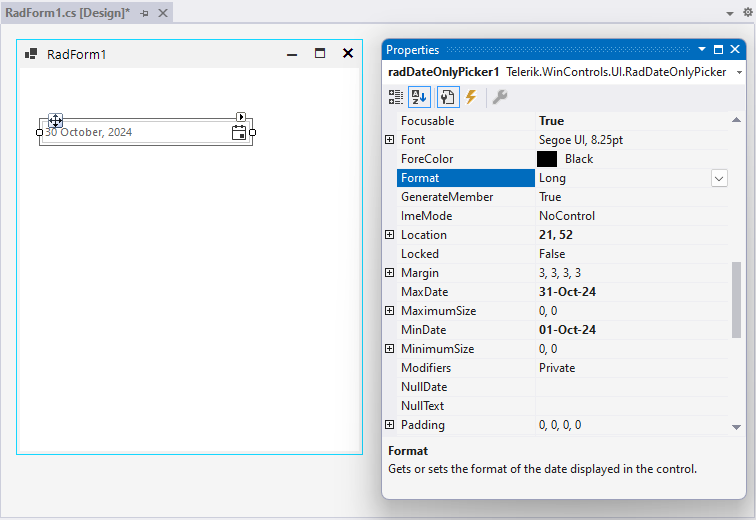
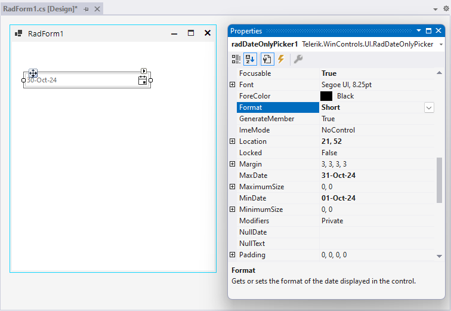
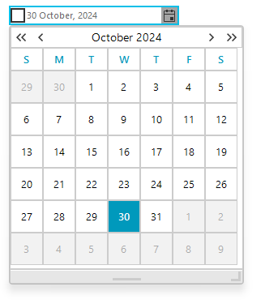

# Getting Started with WinForms DateOnlyPicker

This article shows how you can start using **RadDateOnlyPicker**.

## Adding Telerik Assemblies Using NuGet

To use `RadDateOnlyPicker` when working with NuGet packages, install the `Telerik.UI.for.WinForms.AllControls` package. The [package target framework version may vary]().

Read more about NuGet installation in the [Install using NuGet Packages]() article.

>tip With the 2025 Q1 release, the Telerik UI for WinForms has a new licensing mechanism. You can learn more about it [here]().

## Adding Assembly References Manually

When dragging and dropping a control from the Visual Studio (VS) Toolbox onto the Form Designer, VS automatically adds the necessary assemblies. However, if you're adding the control programmatically, you'll need to manually reference the following assemblies:

* __Telerik.Licensing.Runtime__
* __Telerik.WinControls__
* __Telerik.WinControls.UI__
* __TelerikCommon__

The Telerik UI for WinForms assemblies can be install by using one of the available [installation approaches](). 

## Defining the RadDateOnlyPicker

The following tutorial demonstrates basic usage of __RadDateOnlyPicker__, formatting and applying themes.

1. Drop __RadDateOnlyPicker__ on the form.

	
          
1. In the __Properties__ window use the drop down calendar to set the __MinDate__ property to the first day of the current month. And set the __MaxDate__ property to the last day of the current month. 

	          

1. Set the __Format__ property to __Short__.

	                   

1. Press __F5__ to run the application. You will only be able to pick dates that are within the current month.

>caption Figure 1: RadDateOnlyPicker with the Fluent theme.
 

## See Also

* [Design Time]()
* [Properties]()
* [Structure]()

## Telerik UI for WinForms Learning Resources
* [Getting Started with Telerik UI for WinForms Components](https://docs.telerik.com/devtools/winforms/getting-started/first-steps)
* [Telerik UI for WinForms Setup](https://docs.telerik.com/devtools/winforms/installation-and-upgrades/installing-on-your-computer)
* [Telerik UI for WinForms Converter](https://www.telerik.com/products/winforms/documentation/ai-coding-assistant/converter/converter)
* [Telerik UI for WinForms Visual Studio Templates](https://docs.telerik.com/devtools/winforms/visual-studio-integration/visual-studio-templates)
* [Deploy Telerik UI for WinForms Applications](https://docs.telerik.com/devtools/winforms/deployment-and-distribution/application-deployment)
* [Telerik UI for WinForms Virtual Classroom(Training Courses for Registered Users)](https://learn.telerik.com/learn/course/external/view/elearning/17/telerik-ui-for-winforms)
* [Telerik UI for WinForms License Agreement)](https://www.telerik.com/purchase/license-agreement/winforms-dlw-s)

