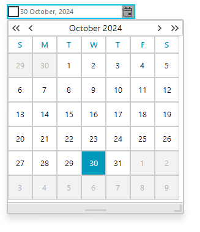

# Getting Started with WinForms DateOnlyPicker

The following tutorial demonstrates basic usage of __RadDateOnlyPicker__, formatting and applying themes.

1. Drop __RadDateOnlyPicker__ on the form.

	
          
1. In the __Properties__ window use the drop down calendar to set the __MinDate__ property to the first day of the current month. And set the __MaxDate__ property to the last day of the current month. 

	          

1. Set the __Format__ property to __Short__.

	                   

1. Press __F5__ to run the application. You will only be able to pick dates that are within the current month.

>caption Figure 1: RadDateOnlyPicker with the Fluent theme.
 

## See Also

* [Design Time]()
* [Properties]()
* [Structure]()

## Telerik UI for WinForms Learning Resources
* [Getting Started with Telerik UI for WinForms Components](https://docs.telerik.com/devtools/winforms/getting-started/first-steps)
* [Telerik UI for WinForms Setup](https://docs.telerik.com/devtools/winforms/installation-and-upgrades/installing-on-your-computer)
* [Telerik UI for WinForms Application Modernization](https://docs.telerik.com/devtools/winforms/winforms-converter/overview)
* [Telerik UI for WinForms Visual Studio Templates](https://docs.telerik.com/devtools/winforms/visual-studio-integration/visual-studio-templates)
* [Deploy Telerik UI for WinForms Applications](https://docs.telerik.com/devtools/winforms/deployment-and-distribution/application-deployment)
* [Telerik UI for WinForms Virtual Classroom(Training Courses for Registered Users)](https://learn.telerik.com/learn/course/external/view/elearning/17/telerik-ui-for-winforms)
* [Telerik UI for WinForms License Agreement)](https://www.telerik.com/purchase/license-agreement/winforms-dlw-s)

