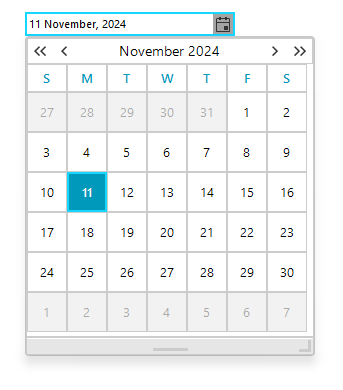

# WinForms DateOnlyPicker Net Core Overview

__RadDateOnlyPicker__ control for WinForms in .NET Core (or .NET 6/7/8 etc.) would serve as a specialized date picker that exclusively deals with __DateOnly__ objects instead of DateTime. In .NET, __DateOnly__ is a new struct introduced to represent dates without time, which is especially useful in applications like scheduling, reporting, or any scenario where only the date is relevant.





>caption Figure 1: RadDateOnlyPicker

## Telerik UI for WinForms Learning Resources
* [Get Started with the Telerik UI for WinForms DateTimePicker]()
* [Telerik UI for WinForms API Reference](https://docs.telerik.com/devtools/winforms/api/)
* [Getting Started with Telerik UI for WinForms Components]()
* [Telerik UI for WinForms Virtual Classroom (Training Courses for Registered Users)](https://learn.telerik.com/learn/course/external/view/elearning/17/TelerikUIforWinForms) 
* [Telerik UI for WinForms Forum](https://www.telerik.com/forums/winforms)
* [Telerik UI for WinForms Knowledge Base](https://docs.telerik.com/devtools/winforms/knowledge-base)

## Telerik UI for WinForms Additional Resources
* [Telerik UI for WinForms Product Overview](https://www.telerik.com/products/winforms.aspx)
* [Telerik UI for WinForms Blog](https://www.telerik.com/blogs/desktop-winforms)
* [Telerik UI for WinForms Videos](https://www.telerik.com/videos/product/winforms)
* [Telerik UI for WinForms Roadmap](https://www.telerik.com/support/whats-new/winforms/roadmap)
* [Telerik UI for WinForms Pricing](https://www.telerik.com/purchase/individual/winforms.aspx)
* [Telerik UI for WinForms Code Library](https://www.telerik.com/support/code-library/winforms)
* [Telerik UI for WinForms Support](https://www.telerik.com/support/winforms)
* [What’s New in Telerik UI for WinForms](https://www.telerik.com/support/whats-new/winforms)

## See Also

* [Design Time]()
* [MaskDateOnlyProvider]()
* [Properties]()
* [Structure]()
