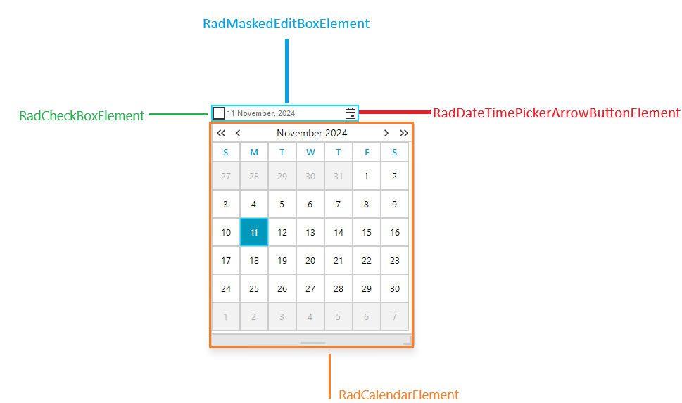
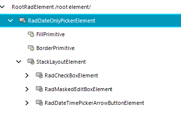

# Structure

The below image shows the structure of RadDateOnlyPicker.

>caption Figure 1: RadDateOnlyPicker structure.

## Elements Hierarchy

Figure 2 shows the elements used in RadDateOnlyPicker.

>caption Figure 2: RadDateOnlyPicker Elements Hierarchy.

## See Also

* [Design Time]()
* [Properties]()
 

