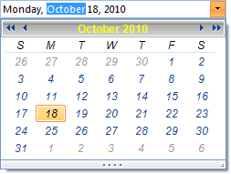

# Customize RadCalendar Programmatically


In order to customize __RadCalendar__ in __RadDateTimePicker__, you should first take the instance of the __RadCalendar__. You can do so by calling the __GetCurrentBehavior__() method. For example, if we want to change the font and colors of the __RadCalendar__ navigation title, we need to use the following code snippet:

#### Changing the font of RadCalendar navigation title 
 
{{source=..\SamplesCS\Editors\DateTimePicker1.cs region=customizeRadCalendarProgramatically}} 
{{source=..\SamplesVB\Editors\DateTimePicker1.vb region=customizeRadCalendarProgramatically}} 

````C#
Font headerFont = new Font("Arial", 9.0f, FontStyle.Bold);
Font datesFont = new Font("Arial", 9.0f, FontStyle.Italic);
RadDateTimePickerCalendar calendarBehavior = this.radDateTimePicker1.DateTimePickerElement.GetCurrentBehavior() as RadDateTimePickerCalendar;
RadCalendar calendar = calendarBehavior.Calendar as RadCalendar;
RadCalendarElement calendarElement = calendar.CalendarElement as RadCalendarElement;
calendarElement.CalendarNavigationElement.Font = headerFont;
calendarElement.CalendarNavigationElement.ForeColor = Color.Yellow;
calendarElement.CalendarNavigationElement.BackColor = Color.White;
calendarElement.CalendarNavigationElement.BackColor2 = Color.Gray;
calendarElement.CalendarNavigationElement.BackColor3 = Color.DarkGray;
calendarElement.CalendarNavigationElement.BackColor4 = Color.Gainsboro;
calendarElement.CalendarNavigationElement.BorderColor = Color.DarkGray;
MonthViewElement monthView = calendarBehavior.Calendar.CalendarElement.CalendarVisualElement as MonthViewElement;
foreach (RadItem item in monthView.TableElement.Children)
{
    item.Font = datesFont;
}

````
````VB.NET
Dim headerFont As Font = New Font("Arial", 9.0F, FontStyle.Bold)
Dim datesFont As Font = New Font("Arial", 9.0F, FontStyle.Italic)
Dim calendarBehavior As RadDateTimePickerCalendar = TryCast(Me.RadDateTimePicker1.DateTimePickerElement.GetCurrentBehavior(), RadDateTimePickerCalendar)
Dim calendar As RadCalendar = TryCast(calendarBehavior.Calendar, RadCalendar)
Dim calendarElement As RadCalendarElement = TryCast(calendar.CalendarElement, RadCalendarElement)
calendarElement.CalendarNavigationElement.Font = headerFont
calendarElement.CalendarNavigationElement.ForeColor = Color.Yellow
calendarElement.CalendarNavigationElement.BackColor = Color.White
calendarElement.CalendarNavigationElement.BackColor2 = Color.Gray
calendarElement.CalendarNavigationElement.BackColor3 = Color.DarkGray
calendarElement.CalendarNavigationElement.BackColor4 = Color.Gainsboro
calendarElement.CalendarNavigationElement.BorderColor = Color.DarkGray
Dim monthView As MonthViewElement = TryCast(calendarBehavior.Calendar.CalendarElement.CalendarVisualElement, MonthViewElement)
For Each item As RadItem In monthView.TableElement.Children
    item.Font = datesFont
Next item

````

{{endregion}} 
 

>caption Figure 1: The result from the above code:



#### Show Clear and Today Buttons

The Clear and Today buttons of the calendar are located in its footer. The footer of the calendar is hidden in the RadDateTimePicker control. To show it, we need to call the  __GetCurrentBehavior__() method to gen an instance of the RadCalendar inside the RadDateTimePicker control.


{{source=..\SamplesCS\Editors\DateTimePicker1.cs region=showCalendarFooter}} 
{{source=..\SamplesVB\Editors\DateTimePicker1.vb region=showCalendarFooter}} 

````C#
RadDateTimePickerCalendar calendarBehavior = this.radDateTimePicker1.DateTimePickerElement.GetCurrentBehavior() as RadDateTimePickerCalendar;
calendarBehavior.Calendar.ShowFooter = true;

````
````VB.NET
Dim calendarBehavior As RadDateTimePickerCalendar = TryCast(Me.radDateTimePicker1.DateTimePickerElement.GetCurrentBehavior(), RadDateTimePickerCalendar)
calendarBehavior.Calendar.ShowFooter = True

````

{{endregion}}


# See Also

* [Customizing Appearance]()
* [Themes]()
