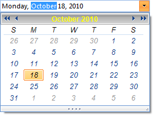

# Customize RadCalendar Programmatically

In order to customize __RadCalendar__ in __RadDateTimePicker__, you should first take the instance of the __RadCalendar__. You can do so by calling the __GetCurrentBehavior__() method. For example, if we want to change the font and colors of the __RadCalendar__ navigation title, we need to use the following code snippet:

#### Changing the font of RadCalendar navigation title 
 
<snippet id='editors-datetimepicker1-customizeradcalendarprogramatically-cs' />
<snippet id='editors-datetimepicker1-customizeradcalendarprogramatically-vb' />

>caption Figure 1: The result from the above code:

#### Show Clear and Today Buttons

The Clear and Today buttons of the calendar are located in its footer. The footer of the calendar is hidden in the RadDateTimePicker control. To show it, we need to call the  __GetCurrentBehavior__() method to gen an instance of the RadCalendar inside the RadDateTimePicker control.

<snippet id='editors-datetimepicker1-showcalendarfooter-cs' />
<snippet id='editors-datetimepicker1-showcalendarfooter-vb' />

# See Also

* [Customizing Appearance]()
* [Themes]()
