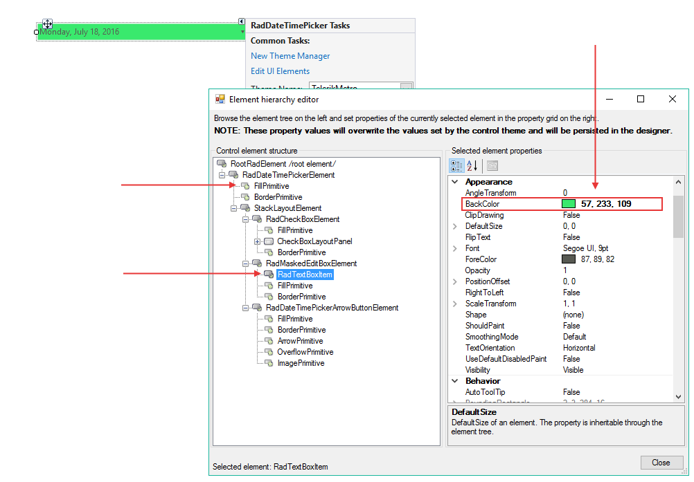

# Customizing Appearance

This article shows how you can change the back color of the control at design time.

1. Open the Element Hierachy editor from the smart tag.
2. Change the __BackColor__ property of __RadTextBoxItem__ and the __FillPrimitive__ of RadDateTimePicker element:
    

# See Also

* [Customize Calendar]()
* [Themes]()
