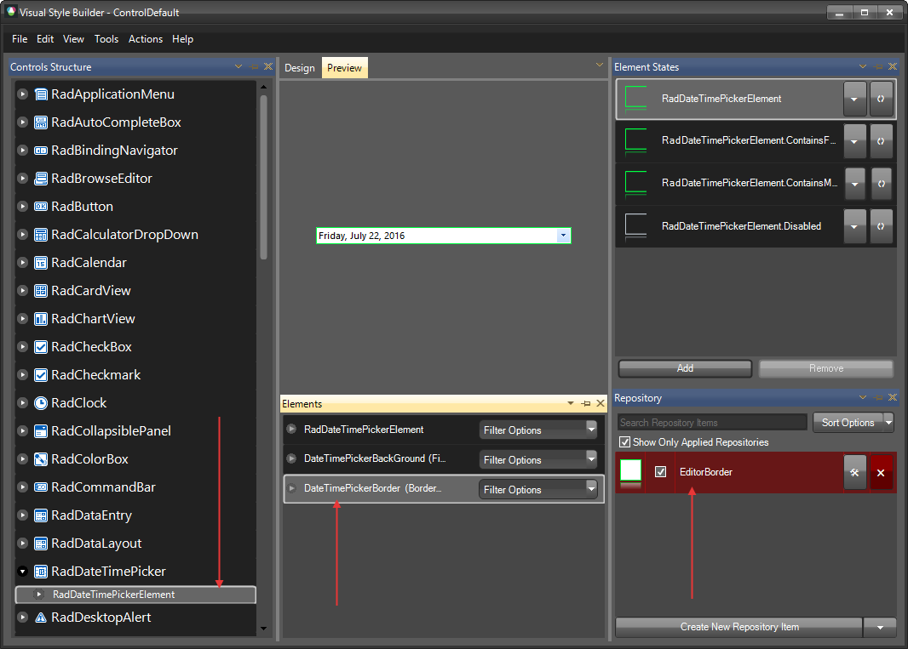
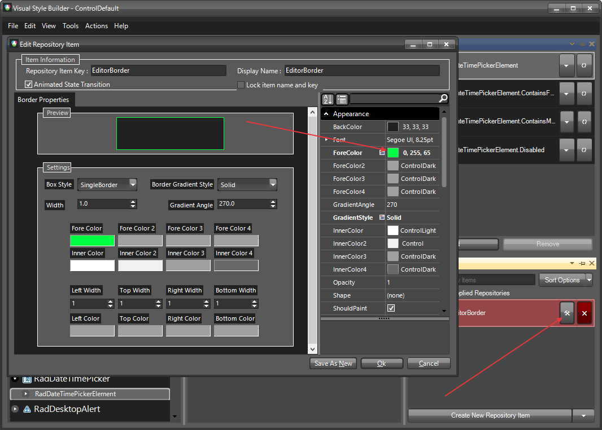
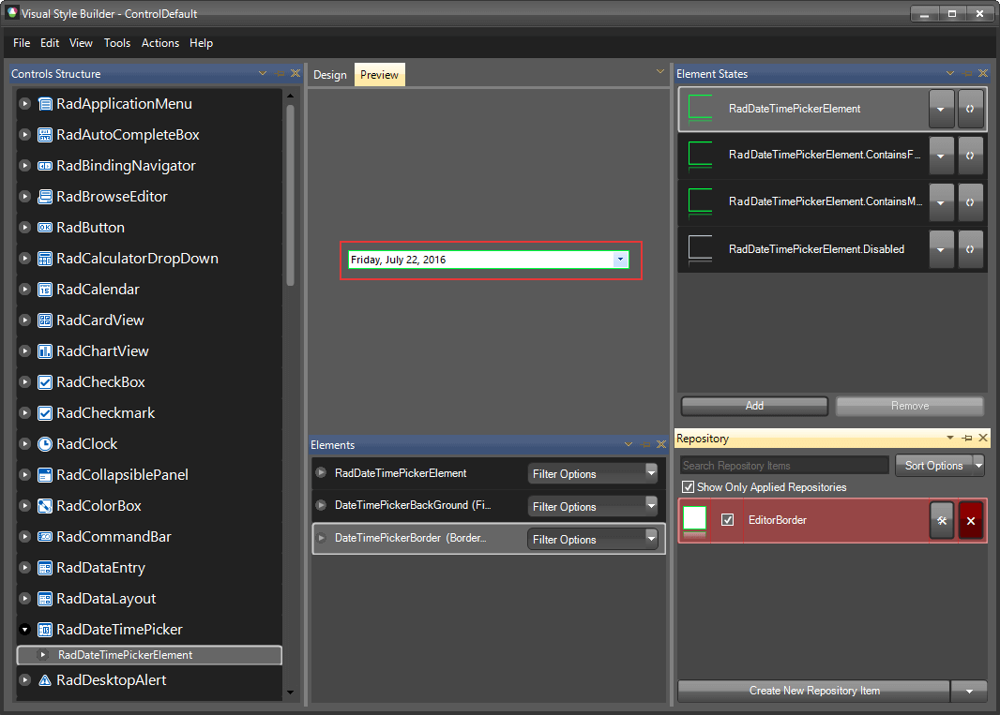

# Themes

This help article will demonstrate a step by step tutorial how to customize the ControlDefault theme for __RadDateTimePicker__.

1. Open [Visual Style Builder] ()
2. Export the built-in themes in a specific folder by selecting `File` >> `Export Built-in Themes`.
3. Load a desired theme from the just exported files by selecting `File` >> `Open Package`.
4. Expand __RadDateTimePicker__ and select the `DateTimePickerBorder`. 
    

5. Open the `Edit Repository Item` dialog and change the __ForeCokor__:
   

6. The BorderColor is now changed:
   

>note The following article shows how you can use the new theme: [Using Custom Themes]().

 
# See Also

* [Customize Calendar]()
* [Customizing Appearance]()
