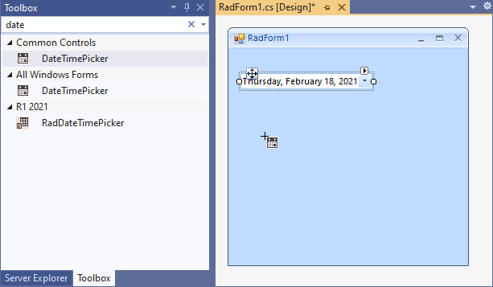
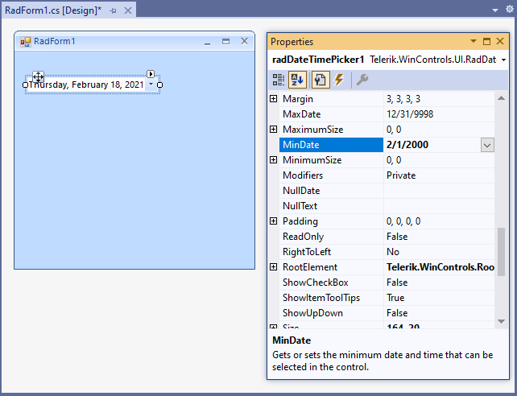
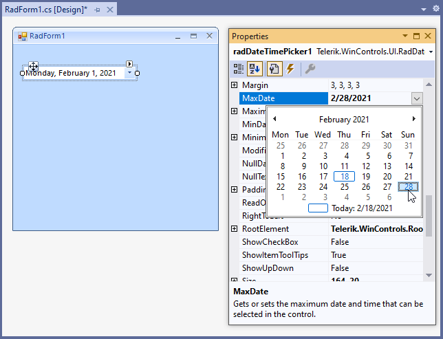
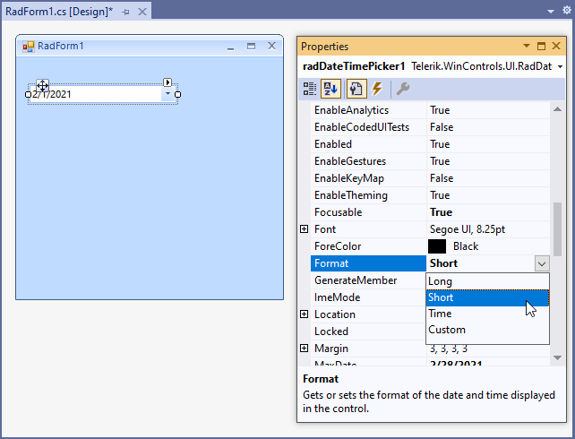
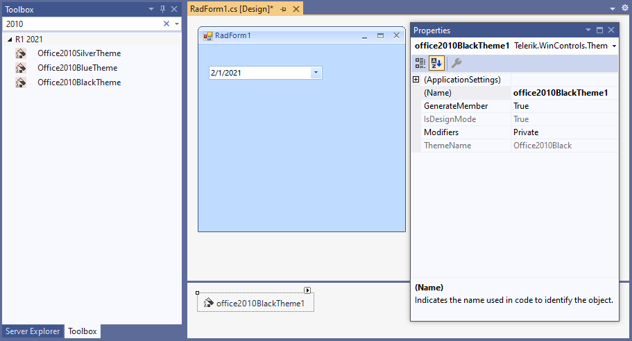
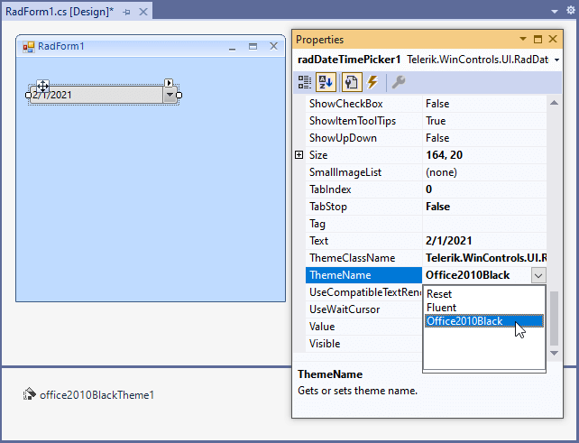
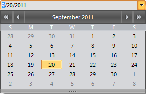

# Getting Started

The following tutorial demonstrates basic usage of __RadDateTimePicker__, formatting and applying themes.

1. Drop __RadDateTimePicker__ on the form.

	
          
1. In the __Properties__ window use the drop down calendar to set the __MinDate__ property to the first day of the current month.

	          

1. Set the __MaxDate__ property to be the last day of the current month.

	           

1. Set the __Format__ property to __Short__.

	           

1. Drag __Office2010BlackTheme__ on the form

	            

1. Set the __ThemeName__ property to __Office2010Black__.

	             

1. Press __F5__ to run the application. You will only be able to pick dates that are within the current month, the drop down calendar will display in the Office2010BlackTheme theme and the date will display in short format.

>caption Figure 1: RadDateTimePicker with the Office2010Black theme.
 

# See Also

* [Design Time]()
* [Free Form Date Time Parsing]()
* [MaskDateTimeProvider]()
* [Properties]()
* [Structure]()