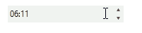

# Tweak Increment Step
 
The rich API of __RadDateTimePicker__ allows you to change the increment/decrement step for each date/time part of the datetime value. For example, you can allow the end-user to increment/decrement the minutes value only by 5 and not by 1 as it is by default. The example below demonstrates how to do this:    

## Increasing increment/decrement step example

When the user clicks the up/down arrow buttons or presses the arrow keys, the __ValueChanged__ event is fired. We need to handle this event for several reasons. First, we need to understand if the value of the __RadDateTimePicker__ is increased or decreased.  Second, we use __ValueChanged__ event to additionally modify the changed value of RadDateTimePicker in the appropriate direction (up or down). Since we are changing a value in __ValueChanged__ event, we need to set and reset a boolean flag, this is necessary because setting the value in the code will trigger the event as well.  

As a prerequisite for the example, __RadDateTimePicker__ should of course show minutes and to demonstrate the full power of the example, we also may want to show up/down arrow buttons instead of a dropdown button. To these customizations, we need to add the following code: 

<snippet id='editors-datetimepicker1-prerequisite-cs' />
<snippet id='editors-datetimepicker1-prerequisite-vb' />

Here is the approach divided into separate steps:

1\. In the form's `Load` event handler subscribe to the __ValueChanged__ event of RadDateTimePicker. Define a DateTime variable globally which holds the initial value: 

<snippet id='editors-datetimepicker1-initialization-cs' />
<snippet id='editors-datetimepicker1-initialization-vb' />

2\. Here comes the ValueChanged handler implementation. In this part we are first checking whether the new value of RadDateTimePicker is bigger than the old one or not. Then, we are getting the MaskDateTimeProvider responsible for the navigation between the date/time parts - hours, minutes, etc. If the provider states that the currently selected time part is minutes, we, depending on the the direction in which we want to change the value, call the __Up/Down__ method four times, so that we can have a step of 5 minutes as a result. Please note that we are setting and resetting the boolean flag __suspendValueChanged__ so that we can safely call __Up/Down__ methods: 

<snippet id='editors-datetimepicker1-valuechanged-cs' />
<snippet id='editors-datetimepicker1-valuechanged-vb' />

The result is shown below. Just with a single click of the up arrow key, we increase the value of the minutes by 5:

# See Also

[Design Time]()
[Free Form Date Time Parsing]()
[MaskDateTimeProvider]()
[Properties]()
[Structure]()
