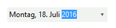

# Internationalization

RadCalendar provides built in internationalization support to build world-ready applications including: 

\* The __Culture__ property can be set using the drop down list in the Properties Window or set in code. The screenshot below shows the __Culture__ property set to "German(Germany)". 

<snippet id='editors-datetimepicker1-culture-cs' />
<snippet id='editors-datetimepicker1-culture-vb' />

>caption Figure 1: The culture is changed to German.

\* Right-to-Left support:          
            

* Right-to-Left = No (default value) 

<snippet id='editors-datetimepicker1-rightno-cs' />
<snippet id='editors-datetimepicker1-rightno-vb' />

>caption Figure 2: The right to left support is turned off.

\*  Right-to-Left = Yes 

<snippet id='editors-datetimepicker1-rightyes-cs' />
<snippet id='editors-datetimepicker1-rightyes-vb' />

>caption Figure 3: The right to left support is turned on.

\* [Date Format Pattern](): The __Format__ property has valid values of __Short__, __Long__, __Time__ and __Custom__. The __Custom__enables the __CustomFormat__ property.  

<snippet id='editors-datetimepicker1-customformat-cs' />
<snippet id='editors-datetimepicker1-customformat-vb' />

>caption Figure 4: Using Custom Format

See the article [Introduction to International Applications Based on .NET Framework](http://msdn2.microsoft.com/en-us/library/t18274tk(vs.80).aspx) for an overview of internationalization in general. 

# See Also

* [CultureInfo and RegionInfo Basics]()
* [Date Formats]()
