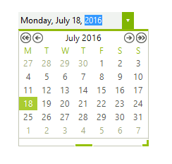

# DateTimePicker

__RadDateTimePicker__ allows interactive selection of dates using a drop down calendar. Features of __RadDateTimePicker__ include:

* Internationalization support.

* Support for theming via pre-defined themes that ship with the product.

* Supports multiple built-in date formats or custom formats.





>caption Figure 1: RadDateTimePicker.

# See Also

* [Design Time]()
* [Free Form Date Time Parsing]()
* [MaskDateTimeProvider]()
* [Properties]()
* [Structure]()
