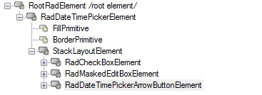

# Structure

The below image shows the structure of RadDateTimePicker.

>caption Figure 1: RadDateTimePicker structure.

## Elements Hierarchy

Figure 2 shows the elements used in RadDateTimePicker.

>caption Figure 2: RadDatatimePicker elements hierarchy.

# See Also

* [Design Time]()
* [Free Form Date Time Parsing]()
* [MaskDateTimeProvider]()
* [Properties]()
 

