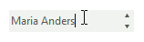
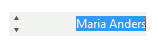

# Features

This article lists the supported features by **RadDomainUpDown**:

* **Data Binding**: via the **DataSource** property you can bind to a collection of custom objects. Additional information is available in the [Data Binding]().
* **Unbound Mode**: it is possible to populate the **Items** collection manually either at [design time]() or [programmatically](). 
* **Auto-Complete**: the boolean **AutoComplete** property indicates whether the auto-complete behavior will be enabled or not while typing in the editable part. As the user types, the next item in the list that matches the user input is automatically appended to the characters the user has already typed. 

	>caption Figure: 1 Auto-complete functionality

	

* **ReadOnly**: when read-only mode is enabled, the user should not be allowed to type in the editor, still selecting items should be possible.

* **Right-to-Left**: **RadDomainUpDown** fully supports right-to-left (RTL) language locales. You can enable/disable the right-to-left support using **RightToLeft** enumeration, which has the following members:

	*Yes*: Content is aligned from right to left.

	*No*: Content is aligned from left to right.

	*Inherit*: Direction will be determined by the parent control.

	>caption Figure: 2 Right-to-Left mode

	

* **Navigation**: The predefined set of items can be navigated by using the arrow buttons, the up and down arrow keys or by double clicking in the editor. The **Wrap** property determines if the selected item will revert to first item after reaching the last item and vice versa while navigating the list. The **SelectNextOnDoubleClick** property controls whether to rotate items on double click in the edit box part. 

# See Also

* [Getting Started]()
* [Structure]()