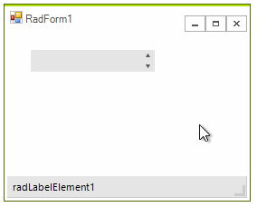
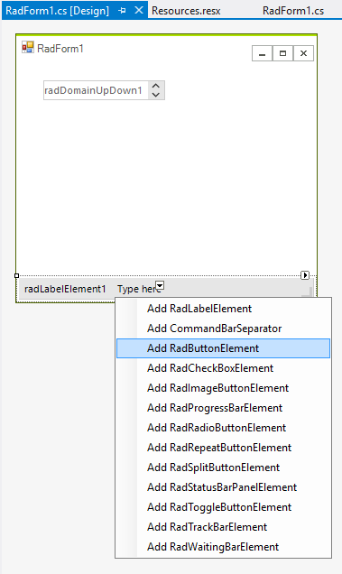
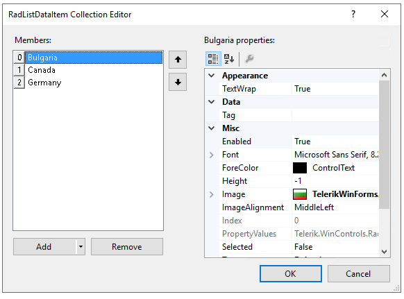

 
The following tutorial demonstrates how to add items and images to a **RadDomainUpDown** and how to retrieve the selected text and image.
>caption Figure 1: Select a country from RadDomainUpDown



1. Add a **RadDomainUpDown** and a **RadStatusStrip** to a form. 

2. Add a few flag images to the project as resources.

3. Using the down arrow of the **RadStatusStrip**, add a **RadLabelElement** and a  **RadButtonElement**. Set the **DisplayStyle** of the **RadButtonElement** to *Image*.
            
	>caption Figure 2: RadStatusStrip item elements

	

4. Select **RadDomainUpDown** and find the **Items** property in the *Properties* Window of Visual Studio. Click the  ellipsis button to open the **RadListDataItem Collection Editor**. Click the `Add` button three times to create three list items. Set the text of the first, second and third item to *Bulgaria*, *Canada* and *Germany* respectively. Set the resource images to the __Image__ property of the items.

	

5. Click **OK** to close the **RadListDataItem Collection Editor**. 

6. Set the **ReadOnly** property to *true* for **RadDomainUpDown**.

7. In the *Properties* Window select the **Events** button. 

8. Locate and double-click the **SelectedIndexChanged** event to create an event handler. 

9. Paste the following code to the **SelectedIndexChanged** event handler. The code retrieves the selected item and assigns the text and image for the selected item to the status bar label and image elements.

#### Handling the SelectedIndexChanged event 

````C#
    
        private void radDomainUpDown1_SelectedIndexChanged(object sender, Telerik.WinControls.UI.Data.PositionChangedEventArgs e)
        {
            if (this.radDomainUpDown1.SelectedIndex > -1)
            {
                this.radLabelElement1.Text = this.radDomainUpDown1.SelectedItem.Text;
                this.radButtonElement1.Image = this.radDomainUpDown1.SelectedItem.Image;
            }
        }

````
````VB.NET

Private Sub radDomainUpDown1_SelectedIndexChanged(ByVal sender As Object, ByVal e As Telerik.WinControls.UI.Data.PositionChangedEventArgs)
    If Me.radDomainUpDown1.SelectedIndex > -1 Then
        Me.radLabelElement1.Text = Me.radDomainUpDown1.SelectedItem.Text
        Me.radButtonElement1.Image = Me.radDomainUpDown1.SelectedItem.Image
    End If
End Sub


````

{{endregion}} 

This is it! Now the change in the selection of the **RadDomainUpDown** instance will be reflected on **RadStatusStrip**.

# See Also

* [Structure]() 
* [Design Time]() 