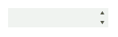

# WinForms DomainUpDown Overview
 
**RadDomainUpDown** is a combination of a text-box and a pair of moving up and down arrow buttons to navigate through a predefined list of items. The control displays a text from a list of string available options. By clicking the up or down arrow button, the user can navigate backward or forward in the items list.





## Key Features

* Items navigation by either using the up/down arrow keys or double clicking in the editor.
* Data-binding - automatically populate the **Items** collection considering the records in the applied collection. Additional information is available in the [Data Binding]().
* Unbound mode - adding the items manually via code.
* Auto-complete functionality - appends text to the user's input if there is a match inside the **Items** collection.

# See Also

* [Design Time]() 
* [Getting Started]()
* [Structure]()
