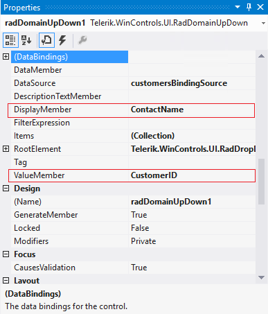
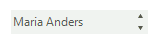
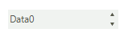

 
# Data binding
 
Data binding is a mechanism for automatic population of the **RadDomainUpDown** with items, based on the provided data structure. Three properties control the data binding:

* __DataSource__ - specifies the data structure to be bound.
          
* __DisplayMember__ - specifies the particular field in the data source which will be used from the items in **RadDomainUpDown** for their Text.
          
* __ValueMember__ - specifies the particular field in the data source which will be stored in the items **Value** property.
          
**RadDomainUpDown** supports data binding either at design time or at run time:

## Data binding at design time

You can set the **DataSource** property at design time in the *Properties* window of Visual Studio.

1. Select the **DataSource** property and click the drop-down arrow to display all existing data sources on the form. 

1. Click the *Add Project Data Source…* link and follow the instructions in the *Data Source Configuration Wizard*  to add a data source to your project. You can use a single database table. 

	>caption Figure: 1 Setting the DataSource at Design time

	

1. Afterwards, you need to specify the __DisplayMember__ and __ValueMember__ properties.

	>caption Figure: 2 Setting the DisplayMember and ValueMember properties at Design time

	

	>caption Figure: 3 RadDomainUpDown bound at Design time

	

## Data binding at run time

You can bind **RadDomainUpDown** programmatically as well. The following code snippet demonstrates how to bind it to a collection of custom objects:

#### Data binding at run time 


````C#

        public RadForm1()
        {
            InitializeComponent();

            List<Item> items = new List<Item>();
            for (int i = 0; i < 10; i++)
            {
                items.Add(new Item(i, "Data" + i));
            }
            this.radDomainUpDown1.DataSource = items;
            this.radDomainUpDown1.DisplayMember = "Description";
            this.radDomainUpDown1.ValueMember = "Id";
        }

        public class Item
        {
            public int Id { get; set; }

            public string Description { get; set; }

            public Item(int id, string description)
            {
                this.Id = id;
                this.Description = description;
            }
        }

````
````VB.NET

    Sub New()
        InitializeComponent()

        Dim items As New List(Of Item)()
        For i As Integer = 0 To 9
            items.Add(New Item(i, "Data" & i))
        Next
        Me.RadDomainUpDown1.DataSource = items
        Me.RadDomainUpDown1.DisplayMember = "Description"
        Me.RadDomainUpDown1.ValueMember = "Id"
    End Sub

    Public Class Item
        Public Property Id() As Integer
            Get
                Return m_Id
            End Get
            Set(value As Integer)
                m_Id = value
            End Set
        End Property
        Private m_Id As Integer
        Public Property Description() As String
            Get
                Return m_Description
            End Get
            Set(value As String)
                m_Description = value
            End Set
        End Property
        Private m_Description As String
        Public Sub New(id As Integer, description As String)
            Me.Id = id
            Me.Description = description
        End Sub
    End Class


````

{{endregion}} 
 
>caption Figure: 4 RadDomainUpDown bound at Run time



# See Also

* [Populating with Data at Design Time]()
* [Adding Items Programmatically]()
* [Design Time]() 
* [Getting Started]()
* [Structure]()