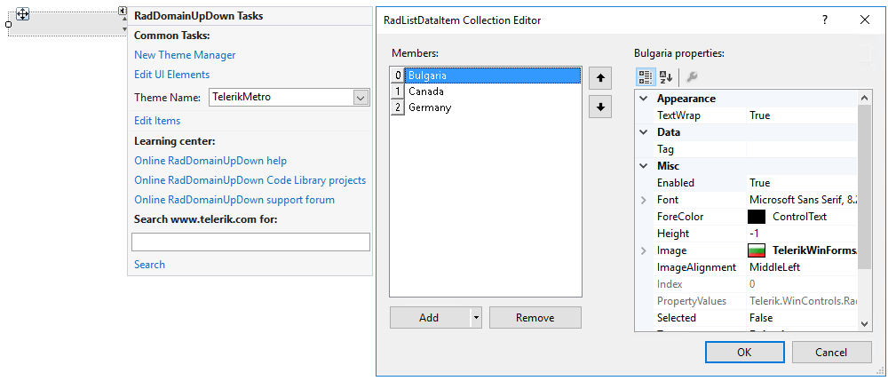
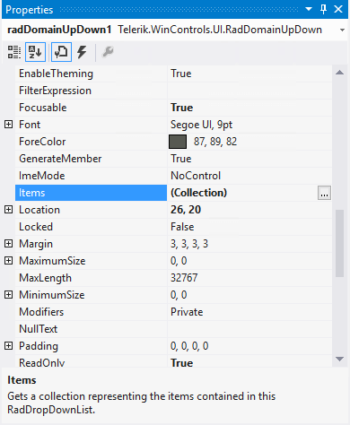

 
# Design time
 
This article demonstrates how to populate **RadDomainUpDown** with data at design time. The *RadListDataItem Collection Editor* allows you to do that. You can access it through the *Smart tag >> Edit Items* option:

>caption Figure 1: RadListDataItem Collection Editor

Another possibility to open the editor is via the **Items** collection in the *Properties* Visual Studio section:

>caption Figure 2:  Visual Studio Properties window

Both ways you can add a **RadListDataItem**  which represents a logical data item which can display specific text and image.

# See Also
* [Adding Items Programmatically]()
* [Data Binding]()
* [Design Time]() 
* [Getting Started]()
* [Structure]()