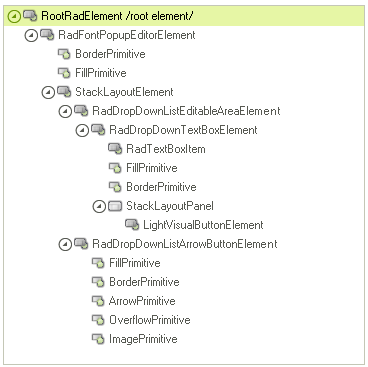
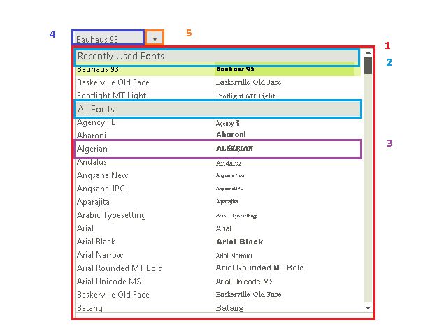

# Structure

This article describes the inner structure and organization of the elements which build the **RadFontDropDownList** control. 

**RadFontDropDownList** internally uses a grouped **RadListViewElement** with default **ViewType** set to *DetailsView*. Two columns are displayed in the pop up list - while the first column stores the font name, the second column shows a preview of the respective font.
        
>caption Figure 1: RadFontDropDownList's elements hierarchy

>caption Figure 2: RadFontDropDownList's structure

1. **RadPopupContainerForm** - represents the pop up container that hosts the **RadListViewElement**.
2. **DetailListViewGroupVisualItem** - represents a visual element for the group item (e.g. *Recently Used Fonts* and *All Fonts* items).  
3. **DetailListViewVisualItem** - represents a visual item illustrating a font option in the pop up.
4. **RadDropDownListEditableAreaElement** - represents the editable area.
5. **RadDropDownListArrowButtonElement** - represents the arrow button that open the fonts pop up 

# See Also

* [RadControlSpy]()
            
