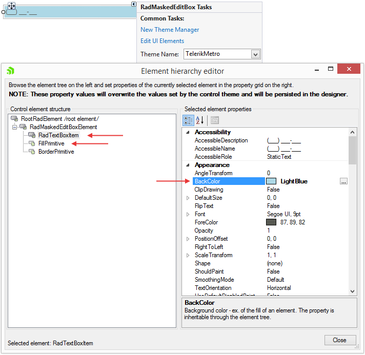

# Accessing and Customizing Elements

Accessing and customizing elements can be performed either at design time, or at run time. Before proceeding with this topic, it is recommended to get familiar with the [visual structure]() of __RadMaskedEditBox__.

## Design time

You can access and modify the style for different elements in __RadMaskedEditBox__ by using the Element hierarchy editor.

>caption Fig.1 Element Hierarchy Editor

{{endregion}} 

# See Also 

* [Element Hierarchy Editor]()
* [Themes]()
