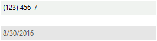

# Getting Started with WinForms MaskedEditBox

Here is how to quickly configure two __RadMaskedEditBox__ controls. One uses a custom phone number mask, the second as a predefined short date pattern.

>caption Figure 1: RadMaskedEditBox Setup

1. Drop two __RadMaskedEditBox__ controls on a form.            

1. In the first __RadMaskedEditBox__ set the __MaskType__ property to __Standard__ and the __Mask__ property to "(###) ###-###". *See *[Standard Masks]()* for more information on how this mask is constructed.*

1. In the second __RadMaskedEditBox__ set the __MaskType__ property to __DateTime__ and the __Mask__ property to "d". * See [Date and Time Masks]()** for more information on how this mask is constructed.*

1. Press __F5__ to run the application. Notice the behavior in the first __RadMaskedEditBox__ where the literals *"("* and *")"* are jumped over and cannot be replaced by the user. Also notice that mask characters are represented by the character in the __PromptChar__ property (by default this is the underscore *"_"* character) when blank.

## See Also

* [Structure]()
* [Smart Tag]()
* [Working with RadMaskedEditBox]()

## Telerik UI for WinForms Learning Resources
* [Telerik UI for WinForms MaskedEditBox Component](https://www.telerik.com/products/winforms/maskededitbox.aspx)
* [Getting Started with Telerik UI for WinForms Components](https://docs.telerik.com/devtools/winforms/getting-started/first-steps)
* [Telerik UI for WinForms Setup](https://docs.telerik.com/devtools/winforms/installation-and-upgrades/installing-on-your-computer)
* [Telerik UI for WinForms Application Modernization](https://docs.telerik.com/devtools/winforms/winforms-converter/overview)
* [Telerik UI for WinForms Visual Studio Templates](https://docs.telerik.com/devtools/winforms/visual-studio-integration/visual-studio-templates)
* [Deploy Telerik UI for WinForms Applications](https://docs.telerik.com/devtools/winforms/deployment-and-distribution/application-deployment)
* [Telerik UI for WinForms Virtual Classroom(Training Courses for Registered Users)](https://learn.telerik.com/learn/course/external/view/elearning/17/telerik-ui-for-winforms)
* [Telerik UI for WinForms License Agreement)](https://www.telerik.com/purchase/license-agreement/winforms-dlw-s)

