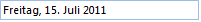

# Working with RadMaskedEditBox

The behavior of the control can be defined by setting up some important properties as well as by handling events.
 
## Properties

__RadMaskedEditBox__ descends from RadTextBox and so has the same properties, methods and events. The significant properties unique to __RadMaskedEditBox__ are:

* __MaskType:__ This property determines how masks are interpreted by the control. Valid values are:

    * __None:__ The control acts like a text box.

    * [Numeric:]() You can define [standard](http://msdn.microsoft.com/en-us/library/dwhawy9k.aspx) numeric masks.

    * [Standard:]() You can define standard masks

    * __Regex:__ You can define [Regex expressions](https://docs.microsoft.com/en-us/dotnet/standard/base-types/regular-expressions) as masks.

    * __IP:__ Predefined mask for IP input.

    * __Email:__ Predefined mask for email validation.

    * __DateTime:__ Predefined mask for DateTime input.

    * __TimeSpan:__ Predefined mask for TimeSpan input. Available since R1 2019.

    * __FreeFormatDateTime:__ With that mask type end-users are able to enter a date and time in a wide range of formats without having to conform to a specific mask. In the following article you can find more information how this DateTime parsing logic works: [Parsing Dates]()

* __Mask:__ A string of characters that constrain user input. The Mask property may contain literals and special mask characters. The MaskType determines how the mask characters are interpreted. Use the backslash "\" character to escape any mask characters so that they display as literals. At runtime, any blank space occupied by a Mask character is displayed as the **PromptChar** property character.

* __PromptChar:__ This property represents the character displayed in any blank space defined by a Mask character.  By default the character is an underscore "_".

* __Culture:__ This property allows you to set the current language and culture from a drop down list at design-time or assign a new  __CultureInfo__ instance at run-time.

>caption Figure 1: RadMaskedEditBox German Culture

 

{{source=..\SamplesCS\Editors\MaskEditBox1.cs region=workingWithRadMaskedEditBox}} 
{{source=..\SamplesVB\Editors\MaskEditBox1.vb region=workingWithRadMaskedEditBox}} 

````C#
            
this.radMaskedEditBox1.MaskType = Telerik.WinControls.UI.MaskType.DateTime;
this.radMaskedEditBox1.Mask = "d";
this.radMaskedEditBox1.Culture = new System.Globalization.CultureInfo("de-de");

````
````VB.NET
Me.RadMaskedEditBox1.MaskType = Telerik.WinControls.UI.MaskType.DateTime
Me.RadMaskedEditBox1.Mask = "D"
Me.RadMaskedEditBox1.Culture = New System.Globalization.CultureInfo("de-DE")

````

{{endregion}}

* __Value:__ This property returns user input without the formatting characters.  If you want the input and the formatting characters, use the __Text__ property.

* __NullText:__ determines the text that will be displayed, when the __Value__ of the control is null.

## Events

__RadMaskedEditBox__ allows you to handle __ValueChanging__ and __ValueChanged__ events. Examine the __Text__ and __Value__ properties to determine user entry with mask and without mask, respectively. __ValueChanging__ also passes a __CancelEventArgs__ parameter containing a __Cancel__ property. When __Cancel__ is set to true the value is not allowed to change.

## MaskType and Mask Examples


| MaskType | Mask | User Input | Displayed as Example |
| ------ | ------ | ------ | ------ |
|Standard|\# ###|12|# 12_|
|Standard|###-##-####|1234|123-4_-____|
|Standard|aaaaa-aaaaa-aaaaa-aaaaa|abc123|abc12-3____-_____-_____|
|DateTime|d|1 1 2007|01/01/2007|
|DateTime|MMM dd|Navigate with|Dec 1|
        
## See Also

* [Standard Masks]()
* [Date and Time Masks]()
* [Numeric Masks]()
* [Properties, Methods and Events]()
