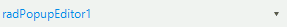
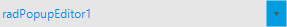
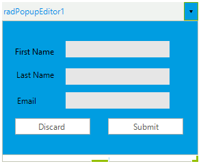

# Customize Elements

## Customizing the Text Box

You can access the text box by using the __TextBoxElement__ property. This allows you to change any property specific to the text box. For example the following code snippet shows how you can change the __Font__ and the __ForeColor__:

#### Customize TextBoxElement 

<snippet id='editors-popupeditorcode-textbox-cs' />
<snippet id='editors-popupeditorcode-textbox-vb' />

>caption Figure 1: Customizing the text box Font and ForeColor.

## Customizing the Arrow Button

The arrow button can be accessed via the __ArrowButtonElement__ property. The following example shows how you can access and set the __BackColor__ of the button:

#### Set arrow button BackColor 

<snippet id='editors-popupeditorcode-button-cs' />
<snippet id='editors-popupeditorcode-button-vb' />

>caption Figure 2: Set Arrow Button BackColor.

## Customizing the Popup

The popup can be access with the __Popup__ property. This gives you access to all public popup properties and elements. For example you can change the __BackColor__ of the popup like this:

#### Change Popup BackColor

<snippet id='editors-popupeditorcode-dropdown-cs' />
<snippet id='editors-popupeditorcode-dropdown-vb' />

>caption Figure 3: Change Popup BackColor.

# See Also

 * [Properties, Events and Methods]()
