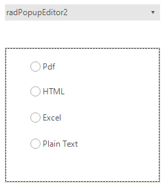
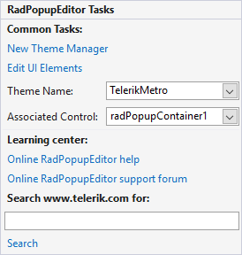

# Design Time

The control allows building the drop down layout at design time. For the purpose you should add [RadPopupContainer]() as well. Once all controls are added to the container you should just associate it (set the __AssociatedControl__ property) with the __RadPopupEditor__ and the controls will appear in the popup.
      
>caption Figure 1: Sample layout built at design time.

# Smart Tag

>caption Figure 2: RadPopupEditor smart tag.

* __Common Tasks__
    - __New Theme Manager:__ Adds a new __RadThemeManager__ component to the form.
    - __Edit UI elements:__ Opens a dialog that displays the __Element Hierarchy Editor.__ This editor lets you browse all the elements in the control.
    - __Theme Name:__ Select a theme name from the drop down list of themes available for that control. Selecting a theme allows you to change all aspects of the controls visual style at one time.
    - __AssociatedControl:__ allows you to set the associated __RadPopupContainer__.
* __Learning Center:__ Navigate to the Telerik help, code library projects or support forum.
* __Search:__ Search the Telerik site for a given string.

# See Also

 * [PopupContainer]()

 * [Getting Started]()
