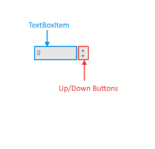

# Structure

The bellow image shows the structure of RadSpinEditor.

>caption Figure 1: RadSpinEditor elements.

* __TextBoxItem:__ Shows the current value, accepts only numeric characters.
* __Up/Down Buttons:__ Used for increasing/decreasing the value.

 
# Elements hierarchy

>caption Figure 2: The RadSpinEditor elements hierarchy.

# See Also

* [Getting Started]()
* [Properties and Events]()