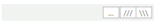

# Adding Buttons to RadTextBox
 

Telerik UI for WinForms are based on a special framework called [Telerik Presentation Framework](). This framework allows for great customizations in the element structure of a control. The purpose of this article is to demonstrate how you can easily add buttons to RadTextBox.
     
>caption Figure 1: RadTextBox with buttons inside it.       



## Adding buttons to RadTextBox

In this particular case we are going to add three buttons to RadTextBox:
        

1\. First, let's create three buttons. In order to arrange them in stacked formation, we need to add them to a [StackLayoutPanel](): 

{{source=..\SamplesCS\Editors\TextBoxWithButtons.cs region=creatingButtons}} 
{{source=..\SamplesVB\Editors\TextBoxWithButtons.vb region=creatingButtons}} 

````C#
RadButtonElement button = new RadButtonElement();
button.Click += new EventHandler(button_Click);
button.Padding = new Padding(2, 0, 2, -2);
button.Margin = new Padding(0, 0, 0, 0);
button.Text = "...";
RadButtonElement button2 = new RadButtonElement();
button2.Click += new EventHandler(button_Click);
button2.Padding = new Padding(2, 0, 2, -2);
button2.Margin = new Padding(1, 0, 2, 0);
button2.Text = "///";
RadButtonElement button3 = new RadButtonElement();
button3.Click += new EventHandler(button_Click);
button3.Padding = new Padding(2, 0, 2, -2);
button3.Margin = new Padding(1, 0, 1, 0);
button3.Text = @"\\\";
StackLayoutElement stackPanel = new StackLayoutElement();
stackPanel.Orientation = Orientation.Horizontal;
stackPanel.Margin = new Padding(1, 0, 1, 0);
stackPanel.Children.Add(button);
stackPanel.Children.Add(button2);
stackPanel.Children.Add(button3);

````
````VB.NET
Dim button As New RadButtonElement()
AddHandler button.Click, AddressOf button_Click
button.Padding = New Padding(2, 0, 2, -2)
button.Margin = New Padding(0, 0, 0, 0)
button.Text = "..."
Dim button2 As New RadButtonElement()
AddHandler button2.Click, AddressOf button_Click
button2.Padding = New Padding(2, 0, 2, -2)
button2.Margin = New Padding(1, 0, 2, 0)
button2.Text = "///"
Dim button3 As New RadButtonElement()
AddHandler button3.Click, AddressOf button_Click
button3.Padding = New Padding(2, 0, 2, -2)
button3.Margin = New Padding(1, 0, 1, 0)
button3.Text = "\\\"
Dim stackPanel As New StackLayoutElement()
stackPanel.Orientation = Orientation.Horizontal
stackPanel.Margin = New Padding(1, 0, 1, 0)
stackPanel.Children.Add(button)
stackPanel.Children.Add(button2)
stackPanel.Children.Add(button3)

````

{{endregion}} 


As you can see, we are also setting the __Padding__ of the buttons. This allows us to set some size to these buttons bigger than the default one. In addition, we are setting the __Margin__ of the buttons, so that there is some space between them.
            

2\. Now we should place the __StackLayoutPanel__ in RadTextBox. In order to achieve the proper layout between the textbox part and the buttons, we need to put the item responsible for the textbox part and the __StackLayoutPanel__ in a __DockLayoutPanel__: 

{{source=..\SamplesCS\Editors\TextBoxWithButtons.cs region=dockLayoutPanel}} 
{{source=..\SamplesVB\Editors\TextBoxWithButtons.vb region=dockLayoutPanel}} 

````C#
RadTextBoxItem tbItem = this.radTextBox1.TextBoxElement.TextBoxItem;
this.radTextBox1.TextBoxElement.Children.Remove(tbItem);
DockLayoutPanel dockPanel = new DockLayoutPanel();
dockPanel.Children.Add(stackPanel);
dockPanel.Children.Add(tbItem);
DockLayoutPanel.SetDock(tbItem, Telerik.WinControls.Layouts.Dock.Left);
DockLayoutPanel.SetDock(stackPanel, Telerik.WinControls.Layouts.Dock.Right);
this.radTextBox1.TextBoxElement.Children.Add(dockPanel);

````
````VB.NET
Dim tbItem As RadTextBoxItem = Me.RadTextBox1.TextBoxElement.TextBoxItem
Me.RadTextBox1.TextBoxElement.Children.Remove(tbItem)
Dim dockPanel As New DockLayoutPanel()
dockPanel.Children.Add(stackPanel)
dockPanel.Children.Add(tbItem)
DockLayoutPanel.SetDock(tbItem, Telerik.WinControls.Layouts.Dock.Left)
DockLayoutPanel.SetDock(stackPanel, Telerik.WinControls.Layouts.Dock.Right)
Me.RadTextBox1.TextBoxElement.Children.Add(dockPanel)

````

{{endregion}} 
 

3\. We are setting some __Margin__ and __Padding__ properties to the elements of RadTextBox which centers the buttons and the text vertically: 

{{source=..\SamplesCS\Editors\TextBoxWithButtons.cs region=finalPadding}} 
{{source=..\SamplesVB\Editors\TextBoxWithButtons.vb region=finalPadding}} 

````C#
this.radTextBox1.TextBoxElement.Padding = new Padding(1, 1, 1, 1);
tbItem.Margin = new Padding(0, 1, 0, 0);

````
````VB.NET
Me.RadTextBox1.TextBoxElement.Padding = New Padding(1, 1, 1, 1)
tbItem.Margin = New Padding(0, 1, 0, 0)

````

{{endregion}} 
 
4\. To complete the scenario, here is the event handler implementation for the Click event: 

{{source=..\SamplesCS\Editors\TextBoxWithButtons.cs region=clickHandler}} 
{{source=..\SamplesVB\Editors\TextBoxWithButtons.vb region=clickHandler}} 

````C#
void button_Click(object sender, EventArgs e)
{
    RadButtonElement button = sender as RadButtonElement;
    RadMessageBox.Show("Clicked! " + button.Text);
}

````
````VB.NET
Private Sub button_Click(ByVal sender As Object, ByVal e As EventArgs)
    Dim button As RadButtonElement = TryCast(sender, RadButtonElement)
    RadMessageBox.Show("Clicked! " & button.Text)
End Sub

````

{{endregion}} 
 
This is it! Now you have a good-looking RadTextBox with buttons!

# See Also

* [Properties]()
* [Design Time]()
* [Structure]()
