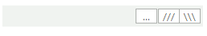

# Adding Buttons to RadTextBox
 

Telerik UI for WinForms are based on a special framework called [Telerik Presentation Framework](). This framework allows for great customizations in the element structure of a control. The purpose of this article is to demonstrate how you can easily add buttons to RadTextBox.
     
>caption Figure 1: RadTextBox with buttons inside it.       

## Adding buttons to RadTextBox

In this particular case we are going to add three buttons to RadTextBox:
        

1\. First, let's create three buttons. In order to arrange them in stacked formation, we need to add them to a [StackLayoutPanel](): 

<snippet id='editors-textboxwithbuttons-creatingbuttons-cs' />
<snippet id='editors-textboxwithbuttons-creatingbuttons-vb' />

As you can see, we are also setting the __Padding__ of the buttons. This allows us to set some size to these buttons bigger than the default one. In addition, we are setting the __Margin__ of the buttons, so that there is some space between them.
            

2\. Now we should place the __StackLayoutPanel__ in RadTextBox. In order to achieve the proper layout between the textbox part and the buttons, we need to put the item responsible for the textbox part and the __StackLayoutPanel__ in a __DockLayoutPanel__: 

<snippet id='editors-textboxwithbuttons-docklayoutpanel-cs' />
<snippet id='editors-textboxwithbuttons-docklayoutpanel-vb' />

3\. We are setting some __Margin__ and __Padding__ properties to the elements of RadTextBox which centers the buttons and the text vertically: 

<snippet id='editors-textboxwithbuttons-finalpadding-cs' />
<snippet id='editors-textboxwithbuttons-finalpadding-vb' />

4\. To complete the scenario, here is the event handler implementation for the Click event: 

<snippet id='editors-textboxwithbuttons-clickhandler-cs' />
<snippet id='editors-textboxwithbuttons-clickhandler-vb' />

This is it! Now you have a good-looking RadTextBox with buttons!

# See Also

* [Properties]()
* [Design Time]()
* [Structure]()
