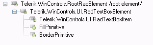

# Structure

__RadTextBoxElement__ is created for the purpose of reusability, as it is not a control, but an element (* Refer to [Telerik Presentation Framework]() section about the difference. *) e.g. RadTextBoxElement can be used in __RadGridView__ control.
 
>caption RadTextBox Elements Hierarchy

* __FillPrimitive__ and __BorderPrimitive__ set the overall background and border properties of the control.
            

* The most important node is __RadTextBoxItem__ which *hosts* the __standard__.NET TextBox control. 

# See Also

* [Properties]()
* [Design Time]()
* [Adding Buttons to RadTextBox]()

