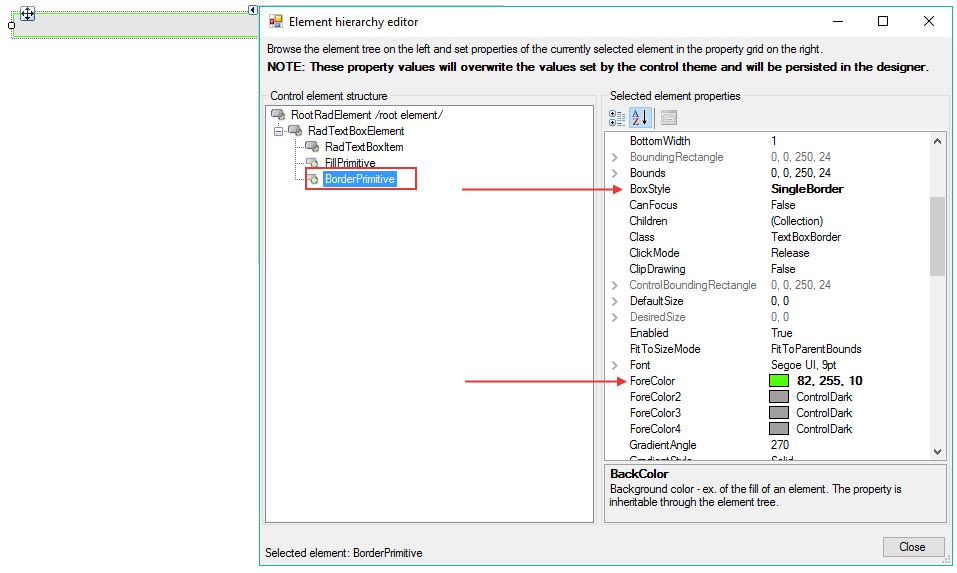

# Customizing Appearance

You can easily change the styles of the border in the `Element Hierarchy Editor`. The following steps are showing how to do that:

1. Open the `Element Hierarchy Editor` from the smart tag.
2. Select __BorderPrimitive__. 
3. Change the __ForeColor__ and the __BoxStyle__ properties:
    

# See Also

* [Themes]()
