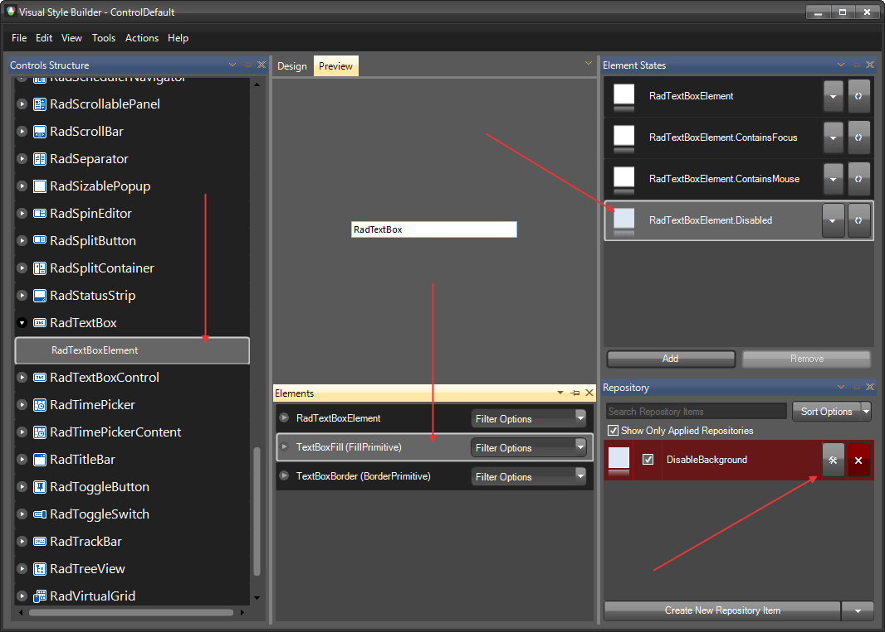
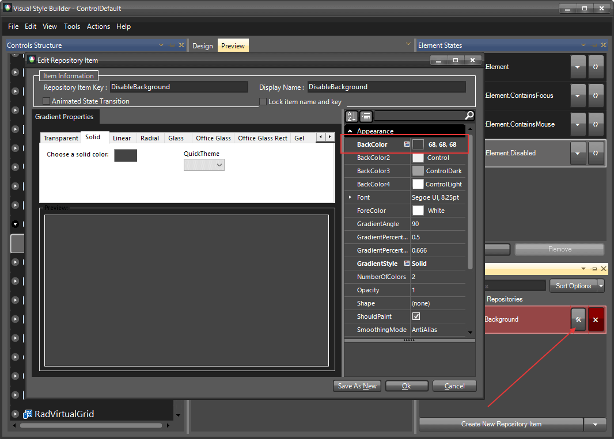
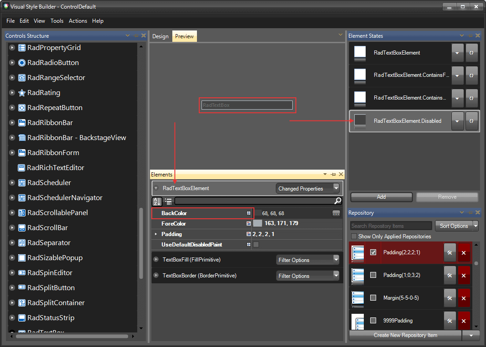

# Themes

This help article will demonstrate a step by step tutorial how to customize the `ControlDefault` theme for __RadTextBox__

1. Open [Visual Style Builder] ()
2. Export the built-in themes in a specific folder by selecting `File` >> `Export Built-in Themes`.
3. Load a desired theme from the just exported files by selecting `File` >> `Open Package`.
4. Expand __RadTextBox__ and select the `TextBoxFill`. Make sure that the __Disabled__ state is selected in the `Element States' window. 
    

5. Open the `Edit Repository Item` dialog and change the `BackColor`:
   

6. Select `RadTextBoxElement` and change the __BackColor__, then save the theme. (you can press Ctrl+H to open the [Spy]() and disable the text box to see the results):
   

>note The following article shows how you can use the new theme: [Using Custom Themes]().

# See Also 

* [Customizing Appearance]()