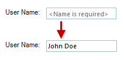
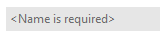
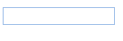

# Properties

__RadTextBox__ shares most of the properties of the standard Windows Forms text box, including:

|Property|Description|
|---|---|
|__BackColor__|Gets or sets the background color of the control.|
|__ForeColor__|Gets or sets the fore color of the text.|
|__Text__|Gets or sets the current text in the control.|
|__CharacterCasing__|specifies whether the user can type upper-case, lower-case, or both.|
|__MaxLength__|sets the maximum number of characters that can be typed into the control. |
|__MultiLine__|controls whether multiple lines of text can be displayed in the control. |
|__UseSystemPasswordChar__|Gets or sets a value indicating whether the text should appear as the default password character.|
|**ShowClearButton**|Gets or sets a value indicating whether the clear button is shown.|
|**NullText**|Gets or sets the text that is displayed when the textbox contains no text. |
|**ShowNullText**|Gets or sets a value indicating whether the null text will be shown when the control is focused and the text is empty.|

## NullText

__RadTextBox__ has a **NullText** property that is not shared by the standard Windows Forms text box. This property specifies what text to be displayed when the control has no __Text__ value. 

>caption Figure 1: Using the null text.

By default, when the control receives  focus, this text is automatically removed. This behavior can be controlled by the **ShowNullText** property. If it is set to *true* the **NullText** will be shown even when the text box is focused until you enter some text in the editor.

|ShowNullText=false|ShowNullText=true|
|----|----|
|||

Since R1 2017 **RadTextBox** can show a clear button when there is some text in the editor. This is controlled by the **ShowClearButton** property.

# See Also

* [Design Time]()
* [Structure]()
* [Adding Buttons to RadTextBox]()