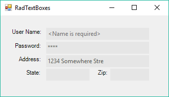

# TextBox

__RadTextBox__ is a [themeable]() alternative to the standard Windows Forms text box control. It allows you to include a text box in your applications that is consistent in look and feel with the other Telerik UI for WinForms controls you use. In addition, it allows you to set a default text to be displayed when there is no actual data in the text box. You can also use [Smart Tags](), set [Properties]() and [Customize its Appearance]().





>caption Figure: 1 RadTextBox

> Download and check out the online demo at [demos.telerik.com](https://telerik-winforms-demos.s3.amazonaws.com/TelerikWinFormsExamplesLauncher.exe)

# See Also

* [Properties]()
* [Design Time]()
* [Structure]()
* [Adding Buttons to RadTextBox]()