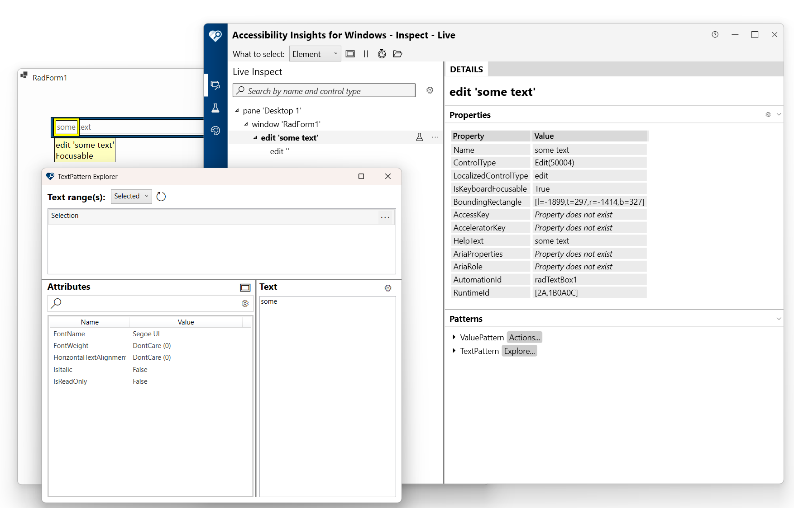

# UI Automation Support

With the __Q2 2025__ version of our controls, RadTextBox supports UI Automation. The current implementation of UI Automation for RadTextBox is similar to the MS WinForms Edit Control Type implementation with some extended functionality. The main goal of this implementation is to ensure compliance with accessibility standards and to provide a common practice for automated testing. 

This functionality is enabled by default. To disable it, you can set the __EnableUIAutomation__ property to false.


````C#

this.radTextBox1.EnableUIAutomation = false;

````
````VB.NET

Me.RadTextBox1.EnableUIAutomation = False

````



## Relevant Properties 

The table below outlines the __UI Automation__ properties most important for understanding and interacting with RadButton control.

* AutomationElementIdentifiers.AutomationIdProperty.Id 
* AutomationElementIdentifiers.BoundingRectangleProperty.Id
* AutomationElementIdentifiers.ClickablePointProperty.Id
* AutomationElementIdentifiers.IsKeyboardFocusableProperty.Id
* AutomationElementIdentifiers.NameProperty.Id 
* AutomationElementIdentifiers.ControlTypeProperty.Id
* AutomationElementIdentifiers.LocalizedControlTypeProperty.Id => "edit"
* AutomationElementIdentifiers.HelpTextProperty.Id
* AutomationElementIdentifiers.IsContentElementProperty.Id
* AutomationElementIdentifiers.IsControlElementProperty.Id
* AutomationElementIdentifiers.IsPasswordProperty.Id
* AutomationElementIdentifiers.IsTextPatternAvailableProperty.Id
* AutomationElementIdentifiers.IsValuePatternAvailableProperty.Id

## Supported Control Patterns

The following section outlines the supported automation patterns for the __RadTextBox__ control and its constituent elements.

* [Text Pattern](https://learn.microsoft.com/en-us/dotnet/api/system.windows.automation.textpattern?view=windowsdesktop-9.0)
* [ValuePattern](https://learn.microsoft.com/en-us/dotnet/api/system.windows.automation.valuepattern?view=windowsdesktop-9.0)

## Events

This section list the events raised by the RadTextBox control.

* __Selection in the control change__: Raises the :
	[UIA TextPatternIdentifiers.TextSelectionChangedEvent](https://learn.microsoft.com/en-us/dotnet/api/system.windows.automation.textpattern.textselectionchangedevent?view=windowsdesktop-9.0#system-windows-automation-textpattern-textselectionchangedevent)

* __OnTextChanged__: Raises the:
	* [UIA TextPatternIdentifiers.TextChangedEvent Field](https://learn.microsoft.com/en-us/dotnet/api/system.windows.automation.textpatternidentifiers.textchangedevent?view=windowsdesktop-9.0#system-windows-automation-textpatternidentifiers-textchangedevent)
	* [UIA AutomationElementIdentifiers.NameProperty Field](https://learn.microsoft.com/en-us/dotnet/api/system.windows.automation.valuepattern.valueproperty?view=windowsdesktop-9.0)
	
* __OnEnabledChanged__: Raises the [UIA AutomationElementIdentifiers.IsEnabledProperty Field](https://learn.microsoft.com/en-us/dotnet/api/system.windows.automation.automationelementidentifiers.isenabledproperty?view=windowsdesktop-9.0#system-windows-automation-automationelementidentifiers-isenabledproperty)

TextPatternIdentifiers.TextSelectionChangedEvent - raised after the selection in the textbox changes
TextPatternIdentifiers.TextChangedEvent - raised after the text in the texbox changes
ValuePatternIdentifiers.ValueProperty - property changed event raised after the text in the texbbox changes


