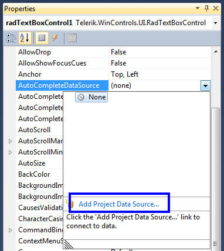
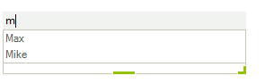
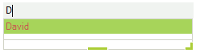

# AutoComplete

The __RadTextBoxControl__ can automatically complete the input string by comparing the prefix being entered to the prefix of all strings in the maintained source. This is useful for __RadTextBoxControl__ in which URLs, addresses, file names or commands will be frequently entered.
        

There are four different completion modes:

* __Append:__ Appends the remainder of the most likely candidate string to the existing characters, highlighting the appended characters.
		  	

* __None:__ Disables the automatic completion feature. 
		  	

* __Suggest:__ Displays the auxiliary drop-down list associated with the control. This drop-down is populated with the matching completion strings.
		  	

* __SuggestAppend:__ Applies both Suggest and Append options.

You can change the completion behavior by setting the __AutoCompleteMode__ property. You can determine the items used for auto-completion by specifying a data source or adding the items manually.
		

## Auto-completion data binding

__RadTextBoxControl__ binds to collections of bindable types from many sources including:

* Array and ArrayList of simple types or custom objects.
				

* Generic Lists of simple types or custom objects.
				

* BindingList or other IBindingList implementations.
				

* Database data using DataTable and DataSet from a wide range of providers (MS SQL, Oracle, Access, anything accessible through OleDb).
				

Two properties control data binding:

* The __AutoCompleteDataSource__ property specifies the source of the data to be bound.
				

* The __AutoCompleteDisplayMember__ property specifies the particular data to be displayed in a RadTextBoxControl auto-completion drop down.
				

To set the __AutoCompleteDataSource__ property, select the __AutoCompleteDataSource__ property in the Properties window, click the drop-down arrow to display all existing data sources on the form. Click the `Add Project Data Source` link and follow the instructions in the `Data Source Configuration Wizard` to add a data source to your project. You can use databases, web services, or objects as data sources.

To set the __AutoCompleteDisplayMember__ property, first set the data source property. Then, select a value for the __AutoCompleteDisplayMember__ property from the drop-down list in the `Properties` window.
		

## Auto-completion in unbound mode

To use auto-completion without specifying a data source, you need to populate the items which will be used for completing the input string in __RadTextBoxControl__, in the __Items__ collection of the control: 

<snippet id='editors-textboxcontrol-addautocompleteitems-cs' />
<snippet id='editors-textboxcontrol-addautocompleteitems-vb' />

Here is the result of the above code:

## Accessing the auto-complete drop down and formating the items

The bellow example shows how you can change the styles of the auto-complete drop down.

First you need to subscribe to the __VisualItemFormatting__ event:
<snippet id='editors-textboxcontrol-subscribe_itemformatting-cs' />
<snippet id='editors-textboxcontrol-subscribe_itemformatting-vb' />

Then you can change the styles in the event handler:

<snippet id='editors-textboxcontrol-formatting_autocomplete-cs' />
<snippet id='editors-textboxcontrol-formatting_autocomplete-vb' />

Here is the result of the above code:

# See Also

* [Caret positioning and selection]()
* [Creating custom blocks]()
* [Structure]()
* [Properties and Events]()
* [Text editing]()
 
