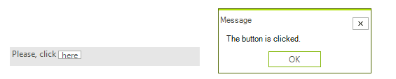

# Creating custom blocks

The __RadTextBoxControl__ allows not only appearance customizations via the formatting event, but also a replacement of the default UI block representation. The __CreateTextBlock__ event exposes this possibility.
        

You should create a custom text block that inherits from __ITextBlock__ and any inheritor of `RadElement`. Let’s create a button text block that should be created for each occurrence of the string here:
        

First, you should create a button that implements __ITextBlock__ interface: 

<snippet id='editors-textboxcontrol-customtextblock-cs' />
<snippet id='editors-textboxcontrol-customtextblock-vb' />

Then you should subscribe to the __CreateTextBlock__ event before initializing the __Text__ property: 

<snippet id='editors-textboxcontrol-applycustomtextblock1-cs' />
<snippet id='editors-textboxcontrol-applycustomtextblock1-vb' />

<snippet id='editors-textboxcontrol-applycustomtextblock2-cs' />
<snippet id='editors-textboxcontrol-applycustomtextblock2-vb' />

Finally, the __Text__ property should be set: 

<snippet id='editors-textboxcontrol-applycustomtextblock3-cs' />
<snippet id='editors-textboxcontrol-applycustomtextblock3-vb' />

>caption Figure 1: The "here" word is replaced with a button.

# See Also

* [Caret positioning and selection]()
* [AutoComplete]()
* [Structure]()
* [Properties and Events]()
* [Text editing]()
