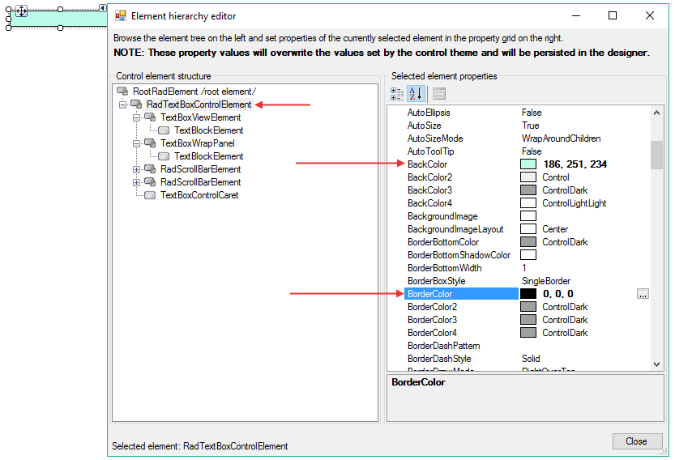

# Customizing Appearance

You can easily change the styles of the border and the BackColor in the `Element Hierarchy Editor`. The following steps are showing how to do that:

1. Open the `Element Hierarchy Editor` from the smart tag.
2. Select __RadTextBoxControlElement__. 
3. Change the __BackColor__ and the __BorderColor__ properties:
    

# See Also

* [Themes]()
* [Formatting]()
